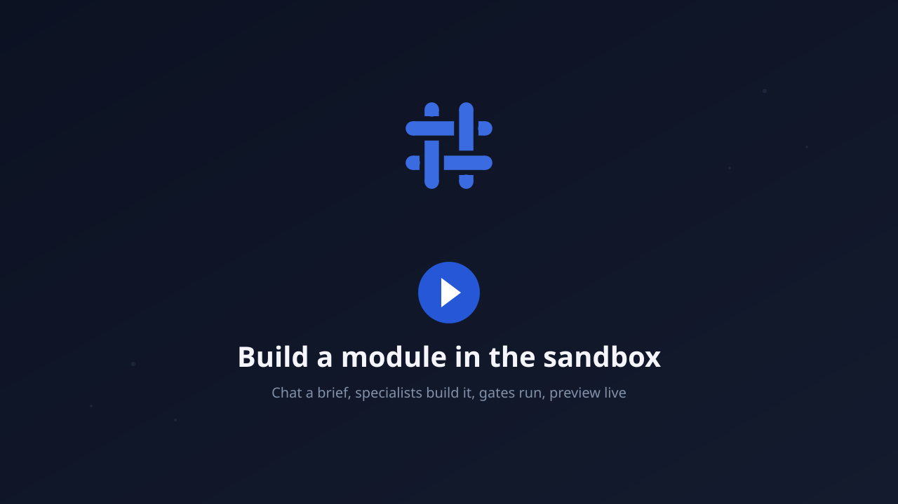
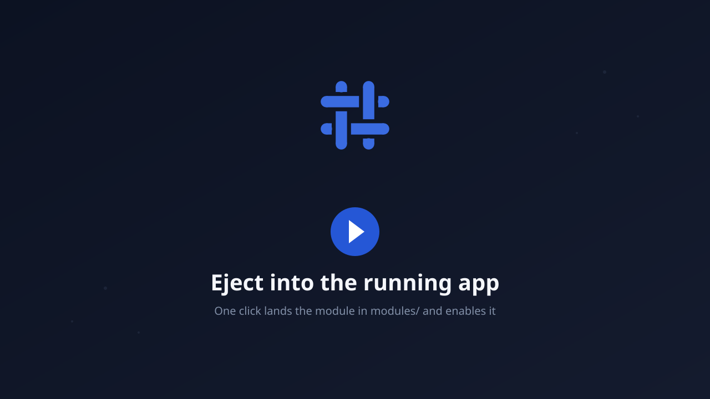
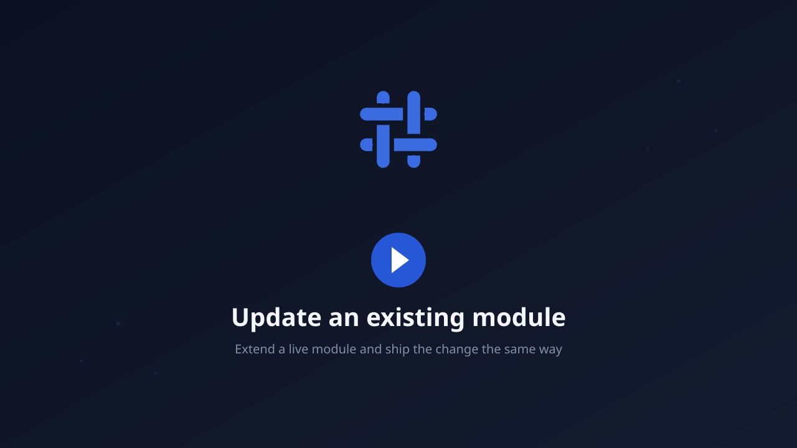
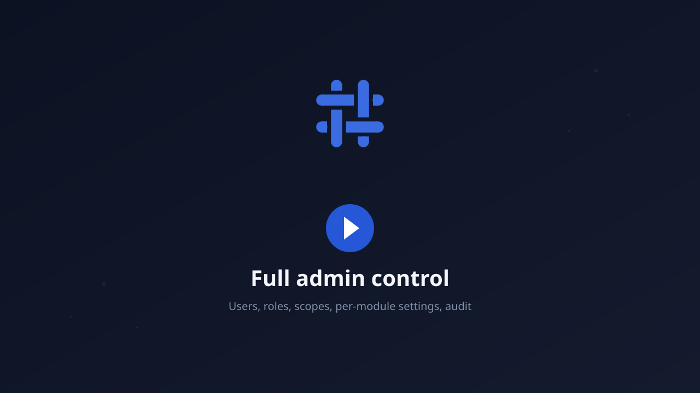

<div align="center">


### The agentic foundation framework for OctaneJS

Ship the platform core once. Let AI specialists build the rest, on top of it.


</div>

Coreloom gives you a production platform core (accounts, workspaces, permissions, module composition, an in-product agent runtime, a capability CLI, and a chat-first sandbox) and a strict module contract on top of it. A business person describes what they need; AI specialists turn it into an approved spec, build it behind gates, preview it live inside the real app shell, and land it in one click. Developers get the same guardrails as skills they can run from their own coding tools.

## What you get

- **A real platform, not a starter.** Sign-in, tenants, roles and scopes, API tokens, per-module settings, and an audit trail are already there and configurable by an admin.
- **A sandbox that builds modules.** Chat a brief; a planner routes it to specialists (business, UX, backend, frontend, agentic); each turn runs the same gates the platform runs; the draft previews inside the real shell before anything lands.
- **One-click delivery.** Eject a finished module straight into `modules/` and enable it, or, in a git repo, open a ready pull request with the gate evidence attached.
- **Safe by contract.** Every endpoint declares a permission, every query is tenant-scoped, generated composition files are CLI-owned, and no change ships without typecheck, tests, schema and format gates.
- **Skills for your own tools.** The procedures in [`.ai/skills`](.ai/skills) (module-new, module-update, core-extend, bug-hunt, auth-security-review, and more) load as `/skill` in Claude Code and as `AGENTS.md` context in Codex, so the same rules apply whether an agent works in the sandbox or in your editor.
- **A durable agent runtime.** `agents.core` runs reusable agents against registered tools with leases, recovery, idempotency, and an append-only audit, configurable per tenant.

## See it in action

<!-- Demo slots: replace each SVG with a GIF or MP4 recorded from the live app (keep the same path). -->

|                                                                                                                                      |                                                                                                                                   |
| ------------------------------------------------------------------------------------------------------------------------------------ | --------------------------------------------------------------------------------------------------------------------------------- |
| [](docs/assets/demo/build-module.svg) | [](docs/assets/demo/eject-to-app.svg) |
| **Build a module in the sandbox**                                                                                                    | **Eject into the running app**                                                                                                    |
| [](docs/assets/demo/update-module.svg)   | [](docs/assets/demo/admin-settings.svg)     |
| **Update an existing module**                                                                                                        | **Full admin control**                                                                                                            |

## How a change ships

```text
brief -> approved spec -> gates -> live preview -> eject (or pull request)
```

Every module starts with an approved specification. Versioned blueprints then constrain its ACL, endpoints, migrations, services, client code, translations, tests, and allowed paths, so routine implementation can be delegated to cost-efficient executor models while architecture and verification decisions stay encoded.

## Start locally

Requirements: Node.js 22.22.2 or newer and pnpm 11.17.0.

```bash
pnpm install
pnpm oerp doctor
pnpm oerp setup quick
pnpm oerp setup quick --apply --confirm reset-local-auth
pnpm dev
```

Open `http://localhost:4310`. Vite HMR is enabled for TSRX, TypeScript, and styles. The custom launcher keeps tool warnings quiet; use `pnpm dev -- --verbose` for full diagnostics.

Quick setup first prints its complete dry-run plan, then creates the local demo only after typed confirmation. The first visit opens the core sign-in flow. `auth.core` keeps the session in an HttpOnly cookie and loads the scopes for the selected tenant membership. The sign-up flow remains available for a clean database.

The bundled `agents.core` module provides reusable agent definitions, an isolated playground, and durable run history. Enqueue returns after the run is committed, so execution continues after navigation, browser close, or sign-out. Agents can reach ERP capabilities only through tools registered against approved API endpoints or CLI capabilities. The default local simulation provider does not call an external model or network service.

## Repository layout

- `platform`: the deployable OctaneJS composition root and TSRX application shell.
- `modules`: the foundation modules (authentication, users, system, agents, sandbox) and the business modules built on top of them.
- `packages`: reusable contracts, kernel, client, server, CLI, sandbox, and agent harness packages.
- `infra`: container, Compose, Kubernetes, and CI deployment assets.
- `.ai`: agent roles, policies, blueprints, examples, and deterministic guardrails.

## Core commands

```bash
pnpm oerp capability list
pnpm oerp spec validate --all
pnpm oerp blueprint validate --all
pnpm oerp module validate
pnpm oerp auth scopes
pnpm oerp agents status
pnpm oerp setup quick
pnpm verify
pnpm build
```

Machine consumers should pass `--json`. Workspace writes are dry-run by default. `--root <dir>` runs any command against another workspace (the sandbox uses it for session workspaces); without it the CLI walks up from the current directory to the nearest `coreloom.json`. `spec validate --all` also covers the platform specs under `specs/`; without `--all` only module specs are checked. Creating a module requires an approved spec and an explicit `--apply`:

```bash
pnpm oerp module new sales.orders \
  --spec modules/sales-orders/spec/module.yaml
```

The scaffold derives everything from the spec: `platform.server` / `platform.client` flags from the capabilities, `src/platform.ts` and `src/client/index.ts` with the canonical `createServerComposition` / `createClientContribution` entries, one `defineEndpoint` per `<ns>.<entity>.read` (list) and `.manage` (create) permission of the first entity, and with the `database` capability a SQLite repository, `OERP_<MODULE>_DATABASE` runtime option, and `migrations/0001_*.up/down.sql`. Files are written through the workspace's Prettier, so the format gate passes without a rewrite. A directory that already holds `spec/module.yaml` or `translations/**` is extended, not rejected; a failed run leaves nothing behind.

`module validate` checks more than the schema: `platform.server` requires `src/platform.ts` and a `./platform` export, `platform.client` requires `src/client/index.ts` and a `./client` export, every declared locale needs a `translations/<locale>.json` with the same keys as the others (errors), and `module.json` version drift against `specVersion` or a locale missing from `coreloom.json` is reported as a warning.

Enabled modules can add namespaced commands such as `customer export`. Discovery uses a declarative JSON catalog and does not execute module code. See [docs/cli-extensions.md](docs/cli-extensions.md).

For a disposable local workspace, `setup quick` prints the reset plan, two seeded logins, and two demo tenants. Apply it only after stopping the development server:

```bash
pnpm oerp setup quick --apply --confirm reset-local-auth
```

The admin seed is `admin@example.com` with password `Admin!23456789`. It can switch between Operations Demo and Finance Demo. The reduced-scope user is `user@example.com` with password `User!234567890`. Quick setup is blocked outside development and test and must never be used for deployed data.

Development navigation is visible only to tenant owners. Authentication sign-up can be disabled at deployment time with `OERP_AUTH_ALLOW_SIGN_UP=false`; the server rejects sign-up and the client removes the sign-up action.

## Sandbox

The sandbox is a separate, chat-first application that builds one module at a
time in an isolated workspace and previews it inside the real application
shell. It is started from any Coreloom workspace and connects to a running
application with an API token:

```bash
npx @coreloom/sandbox
```

Issue the token in the application under Administration, API tokens, and grant
sandbox access under Development, Sandbox, or from the CLI:

```bash
pnpm oerp sandbox grant --email admin@example.com --tenant operations-demo --apply
pnpm oerp sandbox access --tenant operations-demo
```

A local sandbox can drive the `claude` or `codex` binary with the operator's own
subscription; a self-hosted sandbox uses bring-your-own-key providers. Each turn
is driven by one specialist role with its own writable paths and gates, and the
roles live in `.ai/agents/sandbox` so a workspace can change them. See
[packages/sandbox/README.md](packages/sandbox/README.md).

## Module composition

Modules join the platform without touching core files. A module declares `platform.server` / `platform.client` in its `module.json`, exposes `createServerComposition` from `src/platform.ts` and `createClientContribution` from `src/client/index.ts`, and is wired in through generated code:

```bash
pnpm oerp module enable <module.id> --apply
pnpm oerp module disable <module.id> --apply
```

`enable` updates the `modules.enabled` list in `coreloom.json`, adds the module to `platform/package.json`, runs `pnpm install` when the package is not linked yet, regenerates `platform/src/generated/modules.{server,client}.ts`, and with `--apply` grants the scopes the module's spec declares to every workspace owner through `auth sync-scopes` (the result is returned as `scopes`; a failed grant is reported as `MODULE_SCOPES_SYNC_FAILED`, and when `auth.core` is not enabled the grant is skipped with a warning). `disable` removes the module from the enabled list and regenerates (`system.core` and `auth.core` are protected). A running `pnpm dev` picks the change up live: the octane plugin reloads server routes when the generated composition changes and the client hot-reloads, so no application rebuild is needed. `pnpm dev` and `pnpm build` also run the sync automatically. The generated files are CLI-owned; never edit them, `platform/octane.config.ts`, or `platform/src/App.tsrx` by hand.

## Authentication configuration

Sign-up is a three-step wizard: workspace name plus a unique workspace id (the slug that becomes the first URL segment, `/{workspace}/{view}`), then the administrator account, then an optional email confirmation step. Bookmarks that point at another workspace you belong to switch the session to it on load.

- `OERP_AUTH_ALLOW_SIGN_UP` (`true`/`false`): expose account creation.
- `OERP_AUTH_EMAIL_CONFIRMATION` (`false` by default): hold the session after sign-up until the address is confirmed. Requires a composed mail transport; keep disabled until one exists.
- `OERP_AUTH_SIGN_IN_PROVIDERS` (comma list, empty by default): external sign-in providers rendered on the sign-in screen, e.g. `google,okta`. Listing a provider only surfaces the button; the matching `/api/auth/sso/{provider}/start` handler must be composed at the platform level.

## Deploy

```bash
docker compose -f infra/docker/compose.yaml up --build
```

CI verifies types, tests, specs, blueprints, formatting, the production build, dependencies, and the container. Tagged releases can publish to GHCR. Kubernetes base manifests live in `infra/kubernetes`.

Architecture and delivery contract: [docs/architecture-blueprint.md](docs/architecture-blueprint.md)
