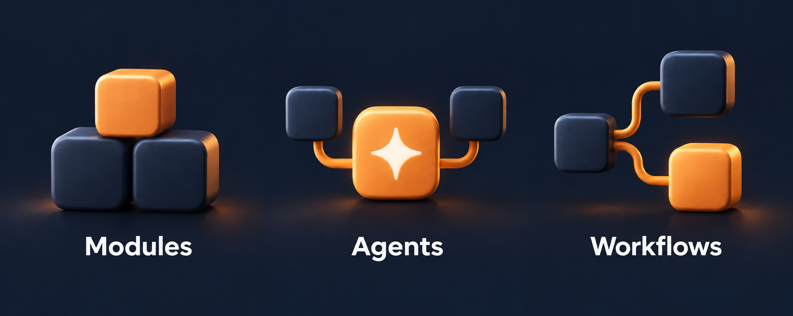

<div align="center">


### Build your business platform. Put agents to work.

Accounts, workspaces, business modules and AI workflows, on a shared foundation.

[](https://github.com/flowdular/flowdular/actions/workflows/ci.yml)


[Website](https://flowdular.com) · [Quick start](#quick-start) · [Build with AI](#build-with-ai) · [Agents and workflows](#agents-and-workflows) · [Documentation](docs/README.md) · [Deployment](infra/README.md)

</div>

Flowdular is an extensible business platform built with OctaneJS and TypeScript.
It provides identity, workspace isolation, permissions, administration and an AI
runtime. Add the screens, data and processes your business needs as modules in
your own codebase.

Business users can describe a change in the sandbox, review its specification
and preview the result. Developers can build the same modules in their coding
tools, using shared contracts and task-specific skills. Both paths produce
versioned source code, migrations and tests.

> **Preview release.** Deployment assets and automated checks are included,
> but APIs and module contracts are still evolving. Review the security model,
> validate your use case and plan backups before deploying business data.

## What is included



| Area              | Capabilities                                                                                                               |
| ----------------- | -------------------------------------------------------------------------------------------------------------------------- |
| Platform          | Accounts, multiple workspaces, roles, permissions, API tokens, audit history and module settings.                          |
| Business modules  | Installable customers, suppliers, catalog and expenses from official-modules; bundled user profiles.                       |
| AI agents         | Provider connections, reusable agents and procedures, registered tools, a playground, durable runs and usage records.      |
| Workflows         | Versioned graphs connecting agents, decisions, validation and module actions, with simulation and live execution.          |
| Automations       | Schedules and signed webhook triggers for agents and workflows.                                                            |
| Sandbox           | Chat-based module development, specification approval, validation gates, application preview and local or GitHub delivery. |
| Work dashboard    | Sessions, drafts, accepted plans, rejected ideas, delivery stages, recorded tokens and provider-reported costs.            |
| Developer tooling | Specification-driven scaffolding, generated composition, a capability CLI and shared instructions through RuleSync.        |

The platform and sandbox include English and Polish translations. New modules
use the same UI components, translation runtime and permission model.

## Quick start

Requires **Node.js 22.22.2 or newer** and **pnpm 11.17.0**. Local development
uses embedded PostgreSQL through PGlite; no database server is required.

```bash
git clone https://github.com/flowdular/flowdular.git
cd flowdular
pnpm install
pnpm flowdular doctor
pnpm dev
```

Open [localhost:4310](http://localhost:4310). On a clean database, create a
workspace and its owner account. Module permissions may need
[synchronization](#module-access-and-owner-permissions) after creating a workspace.

<details>
<summary>Optional: reset the local database and create demo accounts</summary>

Stop the development server first. This resets **all module data in the local
database**, then creates two demo workspaces. Back up any data you need to keep.
Never run it against a custom or deployed database.

```bash
pnpm flowdular setup

# Restore scopes omitted by the current demo seed.
pnpm flowdular auth sync-scopes --module workflows.core --apply
pnpm flowdular auth sync-scopes --module automations.core --apply
pnpm flowdular auth sync-scopes --module expenses.core --apply
pnpm flowdular auth sync-scopes --module profile.core --apply

pnpm dev
```

| Account             | Password         | Access                                    |
| ------------------- | ---------------- | ----------------------------------------- |
| `admin@example.com` | `Admin!23456789` | Owner of Operations Demo and Finance Demo |
| `user@example.com`  | `User!234567890` | Reduced-scope member of Operations Demo   |

These credentials are public development defaults. Never use them in a
deployment. Local database files and development keys live in `.flowdular/data`.

</details>

[Getting started](docs/getting-started.md) covers local state, configuration
and migration from older workspaces.

## Build with AI

Start the sandbox alongside the platform:

```bash
pnpm sandbox
```

Open [localhost:4320](http://localhost:4320), then connect it using a platform
API token and a sandbox access grant. Follow the
[connection guide](docs/sandbox.md#connect-it-to-a-running-application).

```text
Describe the work -> Review and approve the spec -> Build and run gates
                 -> Preview the module -> Deliver locally or open a PR
```

A session can create or update multiple modules. Coding specialists work in a
separate workspace, and you approve the exact specification before
implementation. Drafts preview in the application shell with a session-local
database. Delivery checks the specification and gates again.

The dashboard lets you search sessions, review their stage, inspect recorded
usage by specialist, and reject, restore or archive an idea. GitHub repository
and reviewer configuration lives in **Delivery settings**. Opening a pull
request does not merge it or mark the change as deployed.

### Models and costs

Loopback mode can use your installed Claude Code or Codex CLI and its existing
authentication, or a provider API key. Self-hosted mode uses API keys only.
Access and charges depend on the provider and your account; a coding-tool
subscription does not automatically authorize business-agent API calls.

Short shared rules and one task-specific skill per phase keep instructions
focused for cost-conscious model selection. The dashboard records usage that
drivers report. Missing usage or pricing remains unknown. Displayed costs are
not subscription charges or invoices.

[Sandbox guide](docs/sandbox.md) · [Dashboard accounting and limitations](docs/sandbox-dashboard.md)

## Agents and workflows

Business agents run inside the platform. Each has instructions, a provider
binding and a restricted set of registered tools. Permissions remain bounded
by the workspace, calling actor and invocation grants. Procedures package
reusable instructions and tool selections.

Workflows connect agents with inputs, decisions, validation, module actions
and outputs. Published revisions pin the execution graph. Simulation uses
supplied fixtures; live runs use configured providers and authorized actions.
Run history records progress, failures and available usage and cost data.
Schedules and signed webhooks can start these processes.

For example, a risk-review module could collect case data, invoke an analysis
agent, validate its structured result and route a decision for review. That is
a module you build on these capabilities, not a preinstalled risk product.

The built-in local agent provider is a deterministic simulation with no model
calls. Workflow simulation, coding-agent usage and live business-agent usage
are separate. A complete sandbox test environment for live agents and
workflows remains in development.

## Build with code

A module owns its specification, permissions, API, migrations, screens,
translations and tests. Start from an explicitly approved specification:

```bash
pnpm flowdular module new sales.orders --spec modules/sales-orders/spec/module.yaml
pnpm flowdular module new sales.orders --spec modules/sales-orders/spec/module.yaml --apply
# Implement and verify the scaffold before enabling it.
pnpm flowdular module enable sales.orders --apply
```

The CLI manages composition and module dependencies. Modules use shared UI
components and access other modules through declared capabilities or registered
tools. [Modules](docs/modules.md) explains the lifecycle;
[`.ai/references/catalog`](.ai/references/catalog) is the pinned reference implementation.
Business modules are installed from [official-modules](https://github.com/Flowdular/official-modules); see [installation and publication](docs/module-distribution.md).

### Shared instructions across coding tools

[`.ai/rules`](.ai/rules) and [`.ai/skills`](.ai/skills) are the source of truth.
RuleSync generates discovery files for Claude Code and Codex from that source.
The root contract contains always-active invariants; a task loads its relevant
skill instead of the full instruction library.

```bash
pnpm rules:generate
pnpm rules:check
```

### Module access and owner permissions

`module enable <id> --apply` grants the module's declared scopes and those of
newly enabled dependencies to existing workspace owners. Sandbox local delivery
also synchronizes module scopes. Members receive access through role assignment.

The current demo reset and new-workspace provisioning use fixed owner
defaults. After either operation, synchronize scopes for the enabled modules
you need. Do the same when adding permissions to an existing module or
deploying a change to another database:

```bash
# Stop the local app before a CLI command opens its embedded database.
pnpm flowdular auth sync-scopes --module workflows.core --apply
```

Restart the app and refresh your session. An enabled module can be absent from
navigation when the account lacks its read scope. Do not reset the database to
repair this condition.

## Database and deployment

Modules use the platform's database provider. The platform supplies drivers
and credentials; repositories use asynchronous, tenant-scoped transactions
and versioned PostgreSQL migrations.

| Environment                                        | Database                                                               |
| -------------------------------------------------- | ---------------------------------------------------------------------- |
| Local development, isolated tests, sandbox preview | Embedded PostgreSQL through PGlite                                     |
| Production                                         | PostgreSQL server with separate migrator, runtime and background roles |

Tenant tables enforce row-level security. The runtime role has neither
`SUPERUSER` nor `BYPASSRLS`. `GET /api/health` and `GET /api/ready` expose
health and readiness checks. See [Database adapters](docs/database-adapters.md).

Copy `infra/docker/.env.example` to `infra/docker/.env` and configure its
four module keys and four PostgreSQL passwords, then run:

```bash
docker compose -f infra/docker/compose.yaml up --build
```

Compose includes PostgreSQL and TLS configuration between the app and database.
Configure HTTPS, secrets and backups for your deployment. Public sign-up is
disabled by default in the container. The [deployment guide](infra/README.md)
covers cookies, database roles, published images and Kubernetes manifests.

The sandbox development server is not a hardened boundary for mutually
untrusted users. Review its [security model](packages/sandbox/README.md#security-model)
and [hosting limitations](docs/sandbox-dashboard.md#ownership) before sharing it.

## Development and verification

```bash
pnpm dev                              # Platform with hot reload
pnpm sandbox                          # Module-building workspace
pnpm verify                           # Rules, types, tests, validation, formatting
pnpm build                            # CLI smoke checks and production build
pnpm flowdular module validate         # Manifests, composition and translations
```

CI runs repository verification, a PostgreSQL adapter matrix, the production
build, dependency auditing and a container build. Local repository tests use
isolated databases. A passing gate is evidence for that check, not a substitute
for reviewing generated code or testing the business process.

Before contributing, read [AGENTS.md](AGENTS.md), select the relevant
[task skill](.ai/skills/README.md), and follow the specification and validation
workflow. Keep changes scoped; do not edit generated composition files by hand.

## Repository map

| Path                    | Purpose                                                          |
| ----------------------- | ---------------------------------------------------------------- |
| [`platform/`](platform) | Deployable application and module composition                    |
| [`modules/`](modules)   | Platform capabilities and business modules                       |
| [`packages/`](packages) | Contracts, database adapters, UI, CLI, sandbox and agent tooling |
| [`.ai/`](.ai)           | Shared rules, task skills, specialist roles and blueprints       |
| [`infra/`](infra)       | Container and Kubernetes deployment assets                       |
| [`docs/`](docs)         | Setup, configuration, architecture and operating guides          |

## Documentation

- [Getting started](docs/getting-started.md): install, run and seed a local demo.
- [Modules](docs/modules.md): specification, implementation, permissions and delivery.
- [Sandbox](docs/sandbox.md): connect a coding workspace to your platform.
- [CLI](docs/cli.md): commands, dry runs and explicit write confirmation.
- [Configuration](docs/configuration.md): environment variables and defaults.
- [Design system](docs/design-system.md): shared components and UI conventions.
- [Architecture decisions](docs/adr): design choices and their context.

## License

MIT.

The public website is maintained in [Flowdular/landing](https://github.com/Flowdular/landing). Clone that repository and run `pnpm dev` there.
