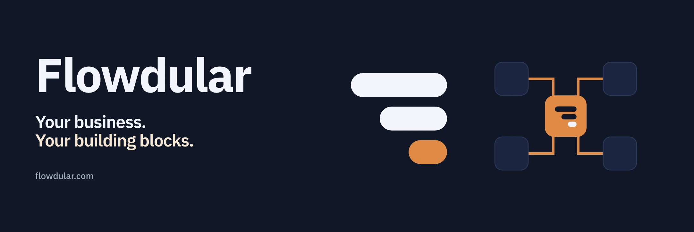

<div align="center">



### Describe a business process. Approve the spec. Ship the module.

An extensible business platform where people and AI agents build the modules a company runs on: accounts, workspaces, permissions, audit, durable jobs and an agent runtime are already there.

[](https://github.com/flowdular/flowdular/actions/workflows/ci.yml)


[Website](https://flowdular.com) · [Quick start](#quick-start) · [How it works](#how-it-works) · [What you get](#what-you-get) · [Documentation](docs/README.md) · [Deployment](infra/README.md)

</div>

## Why Flowdular

Most business software is the same 80 percent: sign-in, workspaces, roles, an audit trail, files, notifications, background jobs, imports, exports, reports. Flowdular ships that 80 percent as versioned modules and makes the remaining 20 percent, the modules your business actually needs, cheap to build and safe to run.

- **Two ways to build, one result.** A business user describes a change in the sandbox and approves a specification; a developer builds the same module in Claude Code or Codex from the same contracts. Both produce source code, migrations, tests and a pull request.
- **Spec-first, gated.** Nothing is implemented without an approved `spec/module.yaml`. Every change passes typecheck, tests, validation and an automated review before it can be delivered.
- **Agents as workers, not oracles.** Business agents run inside the platform with registered tools, bounded permissions, signed grants for anything external or destructive, and a full run history with costs.
- **Production from day one.** PostgreSQL with row-level security on every tenant table, separate migrator and runtime roles, encrypted objects, key rotation, backup and point-in-time recovery, tracing and metrics.

> **Preview release.** APIs and module contracts still evolve. Review the security model and plan backups before you put business data on it.

## Quick start

Node.js 22.22.2 or newer and pnpm 11. Local development uses embedded PostgreSQL; nothing to install.

```bash
npm create flowdular@latest my-app
cd my-app
pnpm install
pnpm dev          # the platform on http://localhost:4310
pnpm sandbox      # the module-building workspace on http://localhost:4320
```

Working on the platform itself? Clone this repository and run `pnpm install && pnpm flowdular doctor && pnpm dev`. [Getting started](docs/getting-started.md) covers demo accounts, local state and configuration.

## How it works

```text
describe the work  ->  approve the spec  ->  build behind gates  ->  preview  ->  deliver (local or pull request)
```

1. **Specification.** A short interview turns the request into a schema-valid module specification: entities, screens, actions, permissions, agent tools, what is out of scope. You approve the exact text; its hash is what implementation is bound to.
2. **Implementation.** A coding agent in the sandbox, or a developer in their own tools, builds the module from the spec and the touch list: API endpoints, tenant-scoped tables and migrations, screens on the shared design system, translations, tests.
3. **Gates and review.** Schema, dependencies, typecheck, tests and format run as deterministic gates; an automated review checks correctness, security, tenancy and lifecycle against the spec; a delivery re-runs everything.
4. **Delivery.** Locally into your workspace, or as a branch and pull request with the gate results as evidence. Business modules you want to share go to [official-modules](https://github.com/Flowdular/official-modules) and install with one command.

```bash
pnpm flowdular module new sales.orders --spec modules/sales-orders/spec/module.yaml --apply
pnpm flowdular module enable sales.orders --apply
pnpm flowdular module install expenses.core@0.8.1 --apply
```

[Modules](docs/modules.md) explains the lifecycle; [Sandbox](docs/sandbox.md) the chat-based path; [`.ai/references/catalog`](.ai/references/catalog) is the pinned reference module.

## What you get

| Area                | Modules and capabilities                                                                                                                                                          |
| ------------------- | --------------------------------------------------------------------------------------------------------------------------------------------------------------------------------- |
| Identity and access | Accounts, workspaces, roles and scopes, API tokens, OIDC sign-in, SCIM provisioning, MFA policy, an access review with attestations, a hash-chained audit trail                   |
| Data lifecycle      | Data classes per module, retention sweeps, workspace export, sealed audit segments, legal holds, erasure with a certificate                                                       |
| Business building   | Documents on an encrypted object store, notifications with e-mail and signed webhooks, CSV import, list export, workspace reports, search with a command palette, tenant settings |
| Agents              | Provider connections, agents and procedures, registered tools with consent and signed grants, a playground, durable runs, metering and budgets                                    |
| Workflows           | Versioned graphs of agents, decisions, validation, human approval and module actions; simulation and live runs; schedules with cron and a tenant time zone; webhook triggers      |
| Integrations        | Connectors with allowlisted hosts, sealed credentials, per-instance consent and a call log; a tracing and metrics surface with an OTLP exporter                                   |
| Building blocks     | A job runner, a mail port, a storage port, list paging on signed cursors, a design system with server-side tables, selection and bulk actions, feature flags on module settings   |

Twenty platform modules ship in this repository; customers, suppliers, catalog and expenses install from official-modules. Everything is in English and Polish.

## Production

One PostgreSQL database with migrator, runtime and background roles that hold neither `SUPERUSER` nor `BYPASSRLS`; forced row-level security on every tenant table; objects encrypted under a rotating key; a backup with key fingerprints, a production restore that runs only under a signed approval, and point-in-time recovery for the Compose stack; health, readiness and metrics endpoints.

```bash
cp infra/docker/.env.example infra/docker/.env   # keys and passwords
docker compose -f infra/docker/compose.yaml up --build
```

[Deployment](infra/README.md) covers the image, Compose, Kubernetes and TLS; [Operations](docs/operations.md) covers backup, restore, key rotation, rollback and the production checklist.

## Contributing

`pnpm verify` runs rules, types, tests, validation and formatting; `pnpm build` runs the CLI smoke checks and the production build. Read [AGENTS.md](AGENTS.md) and pick the [task skill](.ai/skills/README.md) that matches the change; the same rules and skills drive Claude Code and Codex through RuleSync.

| Path                    | Purpose                                                          |
| ----------------------- | ---------------------------------------------------------------- |
| [`platform/`](platform) | Deployable application and module composition                    |
| [`modules/`](modules)   | Platform capabilities and business modules                       |
| [`packages/`](packages) | Contracts, database adapters, UI, CLI, sandbox and agent tooling |
| [`.ai/`](.ai)           | Shared rules, task skills, specialist roles and blueprints       |
| [`infra/`](infra)       | Container and Kubernetes deployment assets                       |
| [`docs/`](docs)         | Guides, operations, architecture decisions and RFCs              |

## License

MIT. The public website lives in [Flowdular/landing](https://github.com/Flowdular/landing).
