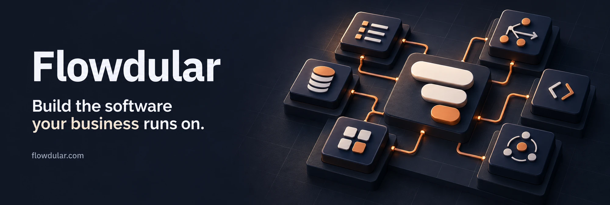
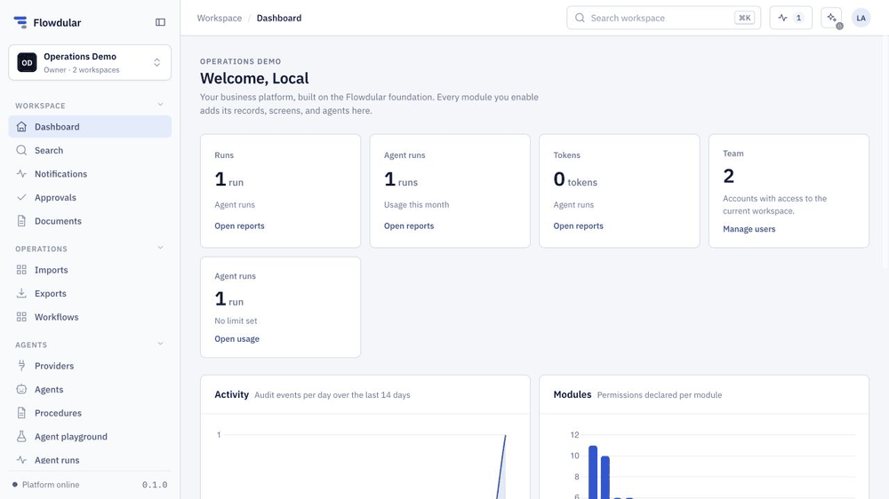
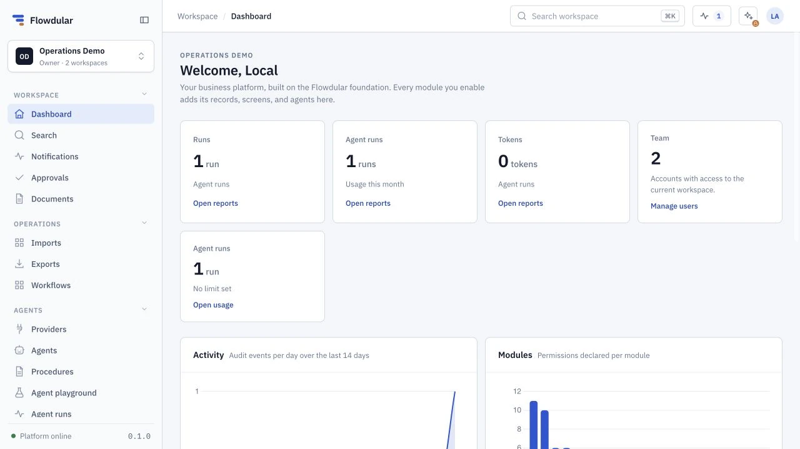
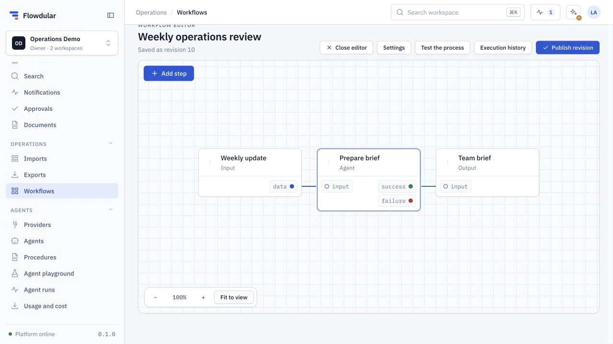
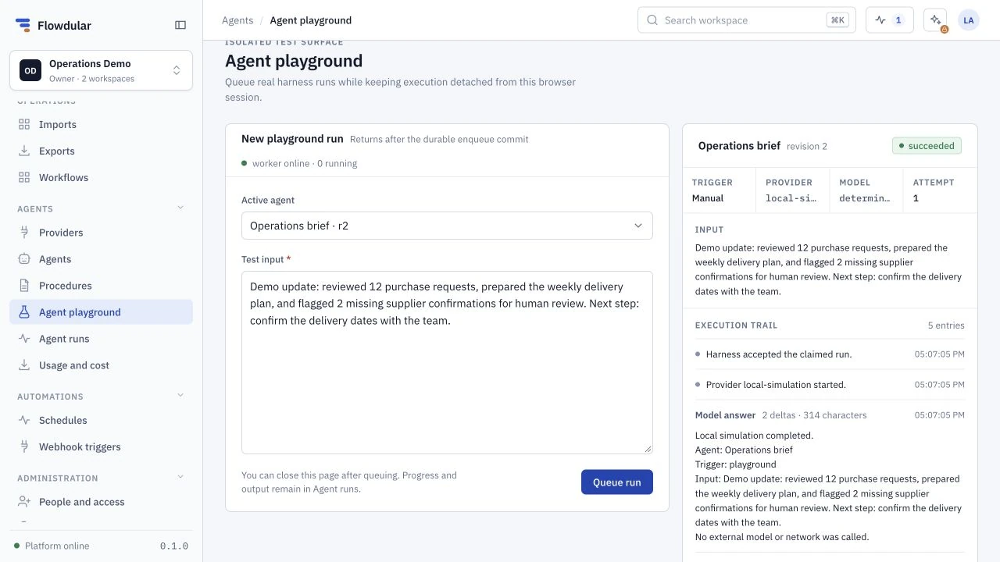

<div align="center">



### Build the software your business runs on.

An open-source business platform for teams building their own tools, operations systems and vertical products. Start with a working workspace, add the modules your business needs, and put people and AI agents to work together.

[](https://github.com/flowdular/flowdular/actions/workflows/ci.yml)
[](https://www.npmjs.com/package/create-flowdular)


[](LICENSE)

[Website](https://flowdular.com) · [See the platform](#see-the-platform) · [Quick start](#quick-start) · [Development](#development-and-direction) · [Documentation](docs/README.md)

</div>

## One foundation. Your business on top.

A new business application needs accounts, workspaces, permissions, files, background jobs and an audit trail before it can handle its first useful process. Flowdular provides that foundation as modules you can extend. Your team can spend its time on the records, decisions and workflows that make the product useful.

- **Build around your process.** Turn a business request into an approved specification, then a module with screens, APIs, migrations, permissions and tests.
- **Keep people in the loop.** Combine agent steps, deterministic actions and human approvals in versioned workflows. Inspect runs, tool calls and costs.
- **Own the application.** Modules are source code in your workspace. Use the chat-first sandbox, Codex, Claude Code or your team's development tools, then review and deploy the result.
- **Reuse what you have built.** A module can contribute screens, business agents, CLI commands and public web pages through the same platform contracts.

> **Preview release.** Flowdular is under active development. APIs and module contracts can change; evaluate it against your requirements before adopting it for business-critical work.

## See the platform

This 24.5-second walkthrough moves through actual platform screenshots: a workspace, agent configuration, a completed local simulation and a draft workflow editor. It uses synthetic sample data. Real AI calls require a configured model provider.



[Full-size MP4](docs/assets/demo/flowdular-product-tour.mp4) · [Full dashboard](docs/assets/demo/flowdular-workspace-full.webp) · [Demo details](docs/assets/demo/README.md)

| A shared workspace                                                                                                              | Workflows with visible steps                                                                                                                             |
| :------------------------------------------------------------------------------------------------------------------------------ | :------------------------------------------------------------------------------------------------------------------------------------------------------- |
|  |  |
| Keep the team's modules and daily work in one place.                                                                            | Design a workflow with visible steps and pinned agent revisions.                                                                                         |

<details>
<summary><strong>Explore the agent workspace</strong></summary>



Define reusable agents, choose their tools and provider, test them in a playground, and inspect durable runs. The default local provider is a simulation. Connect a model provider to run real AI calls.

</details>

## What can you build?

These are examples of applications to build on Flowdular. Their industry-specific rules and screens belong in your own modules.

| Your team               | An application you could build                      | Foundation you can reuse                                          |
| :---------------------- | :-------------------------------------------------- | :---------------------------------------------------------------- |
| Operations              | Purchasing, order tracking or an internal ERP       | Workspaces, roles, records, documents, imports and exports        |
| Product company         | A vertical SaaS product or customer portal          | Tenant isolation, module screens, public web pages and API tokens |
| Finance and procurement | Expense review or supplier qualification            | Approval requests, audit history, workflows and connectors        |
| Research and case teams | Gather evidence, review a case and produce a report | Web research, document text, agents and PDF/DOCX templates        |

[Official Modules](https://github.com/Flowdular/official-modules) provides optional business modules for parties (customers and suppliers), catalog and expenses. Install those you need or build your own.

## From a request to a working module

```text
Describe the work → Approve the spec → Build → Preview → Review → Deliver
```

1. **Describe the business need.** Define the records, screens, actions and permissions. Record the decisions and what is out of scope in `spec/module.yaml`.
2. **Approve the specification.** In the sandbox, implementation is tied to the exact approved spec hash. An agent cannot approve its own work.
3. **Build and preview.** The sandbox's specialists, or a developer in their own tools, implement the module against shared contracts and the design system. The sandbox previews it inside the application shell with an isolated database.
4. **Review and deliver.** Run validation, types, tests, formatting and automated review. Eject the change into your workspace or deliver a branch and pull request with the gate results.

The result is a module your team can read, test, change and version. [Module guide](docs/modules.md) · [Sandbox guide](docs/sandbox.md) · [Reference module](.ai/references/catalog)

## Quick start

Use Node.js **22.22.2 or newer** and **pnpm 11.17.0**. Local development uses PGlite, an embedded PostgreSQL implementation, so it needs no separate database server.

```bash
npm create flowdular@latest my-app
cd my-app
pnpm flowdular setup
pnpm dev
```

The generator installs dependencies by default. `setup` opens an interactive wizard for a local demo, PostgreSQL configuration or a health check. Start it before the application; it asks for confirmation before resetting a local demo database.

Open [localhost:4310](http://localhost:4310). The starter includes identity, workspaces, agents, automations, workflows and sandbox access. The repository includes additional platform modules described below.

To build through chat, open a second terminal:

```bash
pnpm sandbox     # http://localhost:4320
```

Connect the sandbox to your running application with a scoped API token and configure its model provider. The [sandbox connection guide](docs/sandbox.md#connect-it-to-a-running-application) covers the required permissions and setup.

Working on Flowdular itself? Clone this repository, then run `pnpm install`, `pnpm flowdular doctor` and `pnpm dev`. [Getting started](docs/getting-started.md) covers local demo accounts and configuration.

## Building blocks available today

| Capability                    | What it gives your application                                                                                                                       |
| :---------------------------- | :--------------------------------------------------------------------------------------------------------------------------------------------------- |
| **Identity and access**       | Accounts, workspaces, roles and scopes, API tokens, OIDC sign-in, MFA policy, SCIM provisioning and access reviews                                   |
| **Business workspace**        | Shared UI components, English and Polish translations, module settings, feature flags, search, reports, CSV import and list export                   |
| **Agents**                    | Provider connections, reusable definitions and procedures, registered tools, a playground, durable runs, metering and budgets                        |
| **Workflows and approvals**   | Versioned graphs, simulation and live runs, agent and module actions, human approval, schedules and signed webhook triggers                          |
| **Documents and research**    | Encrypted attachments, document text extraction, versioned PDF/DOCX templates, web search adapters and recorded evidence                             |
| **Integrations**              | Connector definitions, sealed credentials, allowed hosts, consent per connection, call history, notifications, mail and storage ports                |
| **Governance and operations** | Tenant-scoped PostgreSQL, forced row-level security, hash-chained audit, retention, legal holds, erasure records, health checks, metrics and tracing |

Capabilities are enabled and configured per application. Optional modules, model providers and external services may require additional setup. The [platform capability card](.ai/platform-capabilities.md) documents the current contracts and gaps.

## Run it on your infrastructure

Flowdular supports PostgreSQL deployments with separate migration, runtime and background roles, encrypted object storage, and container or Kubernetes deployment assets. Your operators configure TLS, secret keys, mail, storage, backups and telemetry.

```bash
cp infra/docker/.env.example infra/docker/.env
# Fill in the required keys and database passwords before starting.
docker compose -f infra/docker/compose.yaml up --build
```

[Deployment guide](infra/README.md) · [Operations and recovery](docs/operations.md) · [Configuration](docs/configuration.md) · [Public API](docs/public-api.md)

## Development and direction

Flowdular's direction is to make business-specific applications easier to build on a shared, governed foundation. Changes start with a concrete business need, an approved contract and executable checks. Architecture decisions and RFCs record what ships and why.

| Area                        | Current position                                                                                                                                            |
| :-------------------------- | :---------------------------------------------------------------------------------------------------------------------------------------------------------- |
| **Extensible applications** | Modules can own data, screens, agents, tools, CLI commands and public web surfaces. Business modules can be distributed separately from the platform.       |
| **Agent-assisted work**     | Durable agents, workflows, human approval, research evidence and document generation are available as reusable capabilities.                                |
| **Delivery and operation**  | The CLI, sandbox, shared rules, verification gates and deployment guides support the path from specification to a running application.                      |
| **Demand-driven additions** | SAML sign-in, an event bus and per-workspace mail wording are deferred until the recorded business triggers are met. They have no committed delivery dates. |

Follow the [architecture decisions](docs/adr), [RFCs](docs/rfc), [deferred decisions](docs/deferred.md) and [release process](docs/platform-releases.md). For a proposal, describe the business problem, the observable outcome and the smallest useful increment in an [issue](https://github.com/Flowdular/flowdular/issues).

## Contributing

Read [AGENTS.md](AGENTS.md) and choose the [task skill](.ai/skills/README.md) for your change. The same rules and procedures support human contributors, Codex and Claude Code through RuleSync.

```bash
pnpm verify      # rules, types, tests, validation and formatting
pnpm build       # CLI smoke checks and production application build
```

| Path                    | Purpose                                                          |
| :---------------------- | :--------------------------------------------------------------- |
| [`platform/`](platform) | Deployable application and module composition                    |
| [`modules/`](modules)   | Platform modules                                                 |
| [`packages/`](packages) | Contracts, database adapters, UI, CLI, sandbox and agent tooling |
| [`.ai/`](.ai)           | Shared rules, skills, specialist roles and blueprints            |
| [`infra/`](infra)       | Container and Kubernetes deployment assets                       |
| [`docs/`](docs)         | Guides, operations, architecture decisions and RFCs              |

## License

Flowdular is [MIT licensed](LICENSE). The public website lives in [Flowdular/landing](https://github.com/Flowdular/landing).
