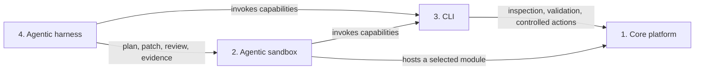
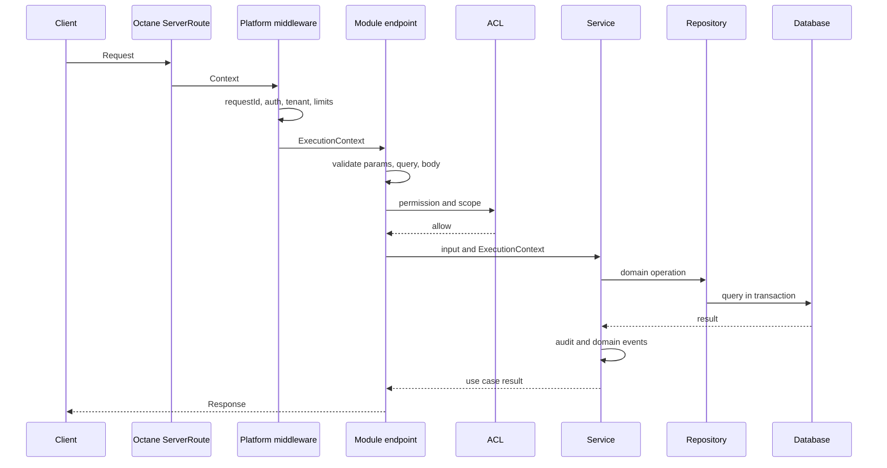

# Coreloom: an agentic foundation framework on OctaneJS

Status: architecture proposal v0.2, with implementation notes added 2026-09-01  
Date: 2026-08-31  
Documentation language: English

Coreloom ships the foundation platform (accounts, workspaces, permissions, modules, agents runtime, CLI, sandbox). People build their own business platform on top of it, either in the sandbox with AI specialists or with the skills in `.ai/skills` inside their own coding tools. Spec-first is a working rule of that process, not the identity of the product.

Sections marked "Not implemented" below describe intent that has no code yet as of 2026-09-01; the note names what exists instead. Agents follow `AGENTS.md` and `.ai/skills`, which describe the code as it is.

## 1. Purpose and authority

The project must let AI agents build the foundation and the business modules on top of it safely in OctaneJS. An agent receives a versioned blueprint, creates changes only in the allowed locations, validates them through the CLI, and presents a working application slice in a lightweight preview.

This document is the root engineering contract. The words MUST, MUST NOT, REQUIRED, SHOULD, and MAY are normative. An agent must stop when a request conflicts with a MUST rule or does not match an approved blueprint.

Module work is spec-driven. A validated and approved specification exists before implementation begins. Prompts provide intent, while specifications provide the implementation contract.

The target flow is:

1. A user describes a business capability.
2. The harness classifies the request into an approved blueprint.
3. A spec author creates or updates schema-valid specifications.
4. The CLI validates and locks the approved specification.
5. The harness creates a schema-valid change plan with fixed path ownership.
6. An agent edits only the files allowed by that blueprint.
7. The CLI validates traceability, manifest, import boundaries, ACL, API, migrations, translations, and tests.
8. The sandbox runs the selected module without booting the complete platform.
9. A human approves the diff and any operation with external impact.
10. The full platform composes approved modules into one application.

## 2. Baseline assumptions

- The repository is a `pnpm` monorepo.
- UI is authored in `.tsrx` and compiled with the Octane toolchain.
- The first development integration uses Vite.
- HTTP uses the native `Request`, `Response`, and Octane `ServerRoute` contracts.
- The kernel does not require a database. A module declares database use in its manifest.
- PostgreSQL is the first production database adapter. Repository ports remain independent of the driver.
- Tenant context is part of the kernel. A single-tenant installation uses a fixed system tenant.
- English and Polish are the reference product locales.
- Technical documentation, ADRs, agent rules, skill instructions, CLI help, code comments, and architecture artifacts are written in English.
- Modules are composed at build time. Runtime downloading of executable module code is outside the first release.
- Public module APIs use explicit endpoints. Octane `module server` functions may be added later as a separately governed capability.
- Routine implementation must be executable by the `executor-basic` model profile. `gpt-5.6-luna` is the initial reference model for that profile.

## 3. Non-negotiable rules

The CLI and contract tests enforce these rules:

1. Every module has one `module.json` manifest that conforms to JSON Schema.
2. Modules import other modules only through public package exports.
3. Client code must not import server, database, Node-only, or secret-bearing code.
4. An endpoint validates and maps data, then calls a service. It contains no business rules.
5. A service does not know about HTTP, Octane components, or browser APIs.
6. Access is denied by default. Every business operation declares a permission or an explicit system execution mode.
7. ACL is enforced on the server. Client-side visibility checks are only a usability feature.
8. Every operation on tenant-owned data receives `tenantId` from trusted execution context.
9. Applied migrations are immutable and protected by checksums.
10. Database rollback is implemented through a new compensating migration.
11. An agent cannot apply a production migration, write to an external system, or run a destructive operation without an approved plan.
12. `.tsrx` code is checked with `tsrx-tsc --noEmit`.
13. Manifests and schemas are static data files. Inspection commands do not execute project TypeScript configuration.
14. Every generated artifact declares its source. Agents do not edit generated files.
15. Every agent change must match an approved, versioned blueprint.
16. The blueprint defines required files, allowed paths, steps, tests, and gates. An agent cannot weaken them inside a feature run.
17. If no blueprint matches, the agent returns `BLUEPRINT_NOT_FOUND` and stops before editing code.
18. Repository technical documentation is written in English. Product copy remains in locale files.
19. Implementation cannot begin before the relevant specification passes validation and receives a content lock.
20. Code, tests, routes, permissions, migrations, screens, and translations trace back to stable specification IDs.
21. An agent cannot change a locked specification and its implementation in the same unreviewed step.
22. Every routine implementation blueprint must pass evals with the `executor-basic` profile before approval.
23. A basic executor receives one atomic task packet, not raw chat history or repository-wide context.
24. Basic executors do not make architecture, dependency, security-policy, public-contract, or production-operation decisions.

## 4. Four monorepo areas



Dependencies are one-way. The platform does not import the sandbox, CLI, or harness. The harness does not reach into platform internals. It uses the versioned CLI capability contract.

### 4.1. Canonical repository tree

```text
octane-erp/
├── package.json
├── pnpm-workspace.yaml
├── pnpm-lock.yaml
├── tsconfig.base.json
├── coreloom.json
├── specs/                            # Machine-readable platform specifications
│   ├── architecture/
│   ├── protocols/
│   └── schemas/
├── docs/
│   ├── architecture-blueprint.md
│   ├── adr/
│   └── module-authoring.md
├── platform/                         # Deployable OctaneJS composition root
│   ├── src/
│   ├── scripts/
│   └── .generated/                  # Static registries created before build
├── modules/                          # Governed ERP modules
│   ├── system/
│   └── auth/
├── packages/                         # Reusable and independently executable packages
│   ├── contracts/
│   ├── kernel/
│   ├── server/
│   ├── client/
│   ├── cli/
│   ├── cli-protocol/
│   ├── sandbox/
│   └── harness/
├── infra/                            # Docker, Compose, Kubernetes, and deployment assets
└── .ai/                              # Agent configuration and examples
    ├── rules/
    ├── blueprints/
    ├── skills/
    ├── agents/
    ├── workflows/
    ├── policies/
    └── examples/
```

`pnpm-workspace.yaml`:

```yaml
packages:
  - platform
  - modules/*
  - packages/*
```

Every matched workspace directory has its own `package.json`, tests, and explicit `exports`. Internal packages use the `@coreloom/*` scope.

## 5. Part 1: core platform

### 5.1. Platform packages

| Package               | Responsibility                                                                      | Must not contain                                  |
| --------------------- | ----------------------------------------------------------------------------------- | ------------------------------------------------- |
| `@coreloom/contracts` | Types, JSON Schema, IDs, module protocol, event contracts                           | IO, Octane runtime, databases                     |
| `@coreloom/kernel`    | Module registry, lifecycle, execution context, ACL, event bus, extension registries | UI, database drivers, HTTP                        |
| `@coreloom/server`    | `ServerRoute` integration, middleware, response serialization, request context      | UI components, module business logic              |
| `@coreloom/client`    | Application shell, navigation, screen registry, i18n, error boundaries              | Database access, secrets, service implementations |
| `@coreloom/database`  | DB adapter interface, migrator, transactions, migration ledger                      | Module business logic                             |
| `@coreloom/testing`   | Test host, fake clock, fake principal, memory adapters, contract test kits          | Production composition root                       |
| `@coreloom/platform`  | Complete application and composition root                                           | Private module imports                            |

### 5.2. Dependency direction

```text
contracts
   ↓
kernel
   ├──→ server
   ├──→ client
   ├──→ database
   └──→ testing
             ↓
modules → public platform contracts
             ↓
platform → registers adapters and modules
```

`platform` is the only complete composition root. It connects authentication, authorization, database, HTTP transport, UI, and the enabled module set. Reusable code belongs in `packages`, while ERP capabilities belong in `modules`.

### 5.3. Execution context

Every use case receives one context:

```ts
export interface ExecutionContext {
	requestId: string;
	principal: Principal;
	tenantId: string;
	locale: string;
	clock: Clock;
	transaction?: TransactionContext;
	audit: AuditWriter;
	events: DomainEventWriter;
}
```

Server middleware creates the context. `principal` and `tenantId` must not come from body, query, or client-controlled route parameters. Background jobs use an explicit `SystemPrincipal` with a process name and audit trail.

### 5.4. Request flow



Global middleware covers at least request ID, safe error handling, body limits, security headers, authentication, tenant resolution, rate limiting for sensitive routes, logging, and metrics.

Octane runs `global → route before → handler → route after`. The first global middleware is the safe error boundary and wraps every lower layer. Authentication and ACL middleware return controlled `Response` objects instead of leaking exceptions into default route handling. A contract test throws an error containing a known secret marker and verifies that the response does not expose it.

### 5.5. Platform specifications

Framework behavior is also spec-first. Machine-readable platform specifications live outside implementation packages:

```text
specs/
├── architecture/
│   ├── platform.spec.yaml
│   ├── module-boundaries.spec.yaml
│   ├── security.spec.yaml
│   ├── sandbox.spec.yaml
│   └── agent-harness.spec.yaml
├── protocols/
│   ├── cli-capabilities.spec.yaml
│   ├── module-manifest.spec.yaml
│   ├── blueprint.spec.yaml
│   └── evidence.spec.yaml
└── schemas/
    ├── platform-spec.schema.json
    ├── module-spec.schema.json
    ├── use-case-spec.schema.json
    ├── api-spec.schema.json
    ├── data-spec.schema.json
    ├── ui-spec.schema.json
    └── acceptance-spec.schema.json
```

Architecture documentation explains decisions to humans. Platform specs define machine-checkable boundaries, behavior, compatibility, and acceptance. A public framework change requires an approved platform spec update, an ADR, and the `contract-change` blueprint before source code can change.

### 5.6. Authentication core

`auth.core` is an enabled platform module and the identity source for `platform`. The composition root installs its authentication middleware before module routes and renders the application shell only after the browser resolves a valid principal with `system.workspace.access`.

The initial adapter owns tenants, accounts, many-to-many memberships, scope grants, and hashed sessions in a single-writer SQLite database. Each session selects exactly one tenant membership. An account may switch only to another granted membership; the switch revokes the old session, rotates the cookie and CSRF token, and reloads role and scopes from the target tenant. Passwords use salted memory-hard hashing. Raw session tokens exist only in the browser's HttpOnly cookie and are persisted only as hashes. Production cookies are host-only, `Secure`, and `SameSite=Strict`. Mutation endpoints verify same-origin request metadata, and sign-out requires a session-bound CSRF token. Missing identity or scope always returns 401 or 403 before protected work executes.

The auth adapter is replaceable behind its repository contract. Password reset, verification, MFA, external identity providers, and a shared database adapter require their own approved specifications.

## 6. Strict ERP module contract

### 6.1. Module profiles

The generator supports four profiles:

| Profile       | Capabilities                                                                   |
| ------------- | ------------------------------------------------------------------------------ |
| `full`        | API, database, client, translations, optional CLI                              |
| `headless`    | API, optional database, optional CLI, no UI                                    |
| `ui`          | Client and translations, consumes public APIs from other modules, optional CLI |
| `integration` | API, services, external connectors, optional database and CLI                  |

The manifest declares capabilities. The validator requires every directory associated with an enabled capability and rejects unknown source areas.

### 6.2. Full module tree

```text
modules/sales-orders/
├── package.json
├── module.json                       # Generated runtime manifest
├── README.md
├── spec/
│   ├── module.yaml
│   ├── use-cases/
│   ├── api/
│   ├── data/
│   ├── ui/
│   ├── acceptance/
│   └── changes/
├── src/
│   ├── index.ts                     # Safe public contracts only
│   ├── server.ts                    # ACL, services, and API contribution
│   ├── database.ts                  # Schema, repositories, migrations
│   ├── contracts/
│   │   ├── ids.ts
│   │   ├── schemas.ts
│   │   ├── events.ts
│   │   └── index.ts
│   ├── domain/
│   │   ├── entities/
│   │   ├── value-objects/
│   │   ├── errors.ts
│   │   └── index.ts
│   ├── acl/
│   │   ├── permissions.ts
│   │   ├── policies.ts
│   │   ├── scopes.ts
│   │   └── index.ts
│   ├── services/
│   │   ├── commands/
│   │   ├── queries/
│   │   ├── ports/
│   │   └── index.ts
│   ├── api/
│   │   ├── endpoints/
│   │   │   ├── create-order.ts
│   │   │   ├── get-order.ts
│   │   │   └── list-orders.ts
│   │   ├── errors.ts
│   │   └── index.ts
│   ├── db/
│   │   ├── schema.ts
│   │   ├── repositories/
│   │   ├── migrations/
│   │   │   └── 20260831T120000Z_create_orders/
│   │   │       ├── meta.json
│   │   │       ├── up.sql
│   │   │       └── verify.sql
│   │   ├── fixtures/
│   │   └── index.ts
│   ├── client/
│   │   ├── routes.ts
│   │   ├── pages/
│   │   │   ├── OrderListPage.tsrx
│   │   │   └── OrderDetailsPage.tsrx
│   │   ├── components/
│   │   ├── hooks/
│   │   ├── api-client.ts
│   │   ├── navigation.ts
│   │   └── index.ts
│   ├── cli/
│   │   ├── commands.json          # Declarative discovery and risk catalog
│   │   └── index.ts               # Loaded only for an invoked module command
│   └── translations/
│       ├── en.json
│       ├── pl.json
│       └── index.ts
└── tests/
    ├── contract.test.ts
    ├── acl.test.ts
    ├── services/
    ├── api/
    ├── db/
    └── client/
```

### 6.3. Module specification

The module specification is the source of product intent. It is committed before implementation files are writable.

```text
spec/
├── module.yaml
├── use-cases/
│   ├── create-order.yaml
│   ├── get-order.yaml
│   └── list-orders.yaml
├── api/
│   ├── create-order.yaml
│   ├── get-order.yaml
│   └── list-orders.yaml
├── data/
│   └── order.yaml
├── ui/
│   ├── order-list.yaml
│   └── order-details.yaml
├── acceptance/
│   ├── create-order.yaml
│   └── list-orders.yaml
└── changes/
    └── ORD-001-initial-orders/
        ├── intent.yaml
        └── acceptance.yaml
```

Each file type has a JSON Schema under `specs/schemas`. A use case specification contains stable IDs and observable behavior:

```yaml
schemaVersion: 1
id: sales.orders.create
kind: command
status: approved
actor: authenticated-user
permission: sales.orders.create
tenantScope: required
input: sales.orders.create.input.v1
output: sales.orders.order.v1
preconditions:
  - customer must exist in the current tenant
  - at least one order line is required
outcomes:
  - code: ORDER_CREATED
  - code: CUSTOMER_NOT_FOUND
  - code: ORDER_LINE_REQUIRED
events:
  - sales.orders.created.v1
acceptance:
  - sales.orders.acceptance.create.standard
  - sales.orders.acceptance.create.forbidden
```

The spec compiler verifies references across domain, use case, API, data, UI, and acceptance files. It then emits a spec graph and content hash. Source, tests, and generated manifests must refer to IDs from that graph.

Implementation paths remain read-only until the run reaches `spec-approved`. A feature run cannot silently edit a locked spec to match code that has already been written.

### 6.4. Module manifest

`module.json` is readable without executing project code:

```json
{
	"$schema": "../../packages/contracts/schemas/module.schema.json",
	"schemaVersion": 1,
	"id": "sales.orders",
	"package": "@coreloom/module-sales-orders",
	"version": "0.1.0",
	"profile": "full",
	"capabilities": ["api", "database", "client", "translations", "cli"],
	"dependencies": [{ "id": "crm.customers", "range": "^1.0.0" }],
	"tenancy": "required",
	"locales": ["en", "pl"],
	"stability": "experimental",
	"cli": {
		"catalog": "src/cli/commands.json",
		"entry": "src/cli/index.ts"
	}
}
```

The CLI generates `module.json` deterministically from `spec/module.yaml` and package metadata. Agents never edit it directly. IDs are namespaced and stable. Changing a module ID, permission ID, endpoint ID, or event name requires an explicit contract migration.

### 6.5. Source ownership

| Area           | Contains                                                            | Forbidden                                                              |
| -------------- | ------------------------------------------------------------------- | ---------------------------------------------------------------------- |
| `spec`         | Approved intent, behavior, interfaces, data, UI, acceptance         | Implementation code, secrets, provider-specific details without an ADR |
| `contracts`    | Input and output schemas, IDs, public events                        | IO, database, service implementations                                  |
| `domain`       | Entities, invariants, value objects, domain errors                  | HTTP, UI, database drivers                                             |
| `acl`          | Permission IDs, scopes, policies                                    | Reading principal directly from a request                              |
| `services`     | Use cases, repository and integration ports, transaction boundaries | `Request`, `Response`, components                                      |
| `api`          | Endpoints, data and error mapping, validation                       | Business rules, direct database access                                 |
| `db`           | Repository implementations, schema, migrations                      | ACL, routing, views                                                    |
| `client`       | Routes, pages, components, API client, navigation                   | Imports from `db`, `services`, or server secrets                       |
| `cli`          | Namespaced capability catalog and matching handlers                 | Core command groups, undeclared risk, direct secret access             |
| `translations` | Keys owned by the module                                            | Keys owned by another module                                           |

### 6.6. Public exports

`src/index.ts` exports only safe, stable contracts. Subpath exports separate environments:

```json
{
	"exports": {
		".": "./src/index.ts",
		"./manifest": "./module.json",
		"./contracts": "./src/contracts/index.ts",
		"./server": "./src/server.ts",
		"./client": "./src/client/index.ts",
		"./database": "./src/database.ts",
		"./translations": "./src/translations/index.ts"
	}
}
```

The import boundary validator allows the client bundle to use only `.`, `./client`, `./contracts`, and `./translations`.

### 6.7. Module registration

Each subpath returns a separate registry contribution. A server contribution does not duplicate the manifest ID or version:

```ts
export default defineServerContribution({
	permissions,
	services,
	serverRoutes,
});
```

The CLI reads `module.json`, validates capabilities, and generates deterministically sorted registries with static imports for `./server`, `./client`, `./database`, and `./translations`. Registries are created under `platform/.generated` before dev or build. Manifest inspection does not execute project code. The build imports only the subpaths needed for its environment, and runtime performs a final manifest-to-contribution compatibility check.

### 6.8. Client contributions and shell slots

The application shell owns layout, navigation behavior, routing state, responsive behavior, and permission filtering. A module never edits the shell to add its screen. It exports one static `ModuleClientContribution` from its public `./client` subpath, and the platform composition root imports that factory at build time.

Each contribution may declare:

- `navigation`: sidebar metadata with a stable ID, target view, fixed group, read scope, and deterministic order;
- `accountMenu`: personal views reached from the account menu behind the topbar avatar instead of the sidebar, with the same ID, target view, scope, and order discipline;
- `views`: render functions addressed by stable view IDs;
- `widgets`: render functions assigned to a named shell slot, read scope, and deterministic order.

The first contract exposes these slots:

| Slot                | Purpose                                         | Layout owner      |
| ------------------- | ----------------------------------------------- | ----------------- |
| `dashboard.metrics` | Compact module summaries below the core metrics | Application shell |
| `dashboard.main`    | Primary dashboard content                       | Application shell |
| `dashboard.aside`   | Secondary status and guidance                   | Application shell |
| `topbar.actions`    | Small context-independent actions               | Application shell |

Navigation groups are limited to `Workspace`, `Operations`, `Administration`, and `Development`. Development screens are separate from the default ERP dashboard and require explicit platform scopes. A view that belongs to the signed-in person rather than to the workspace, such as the profile screen, is contributed through `accountMenu` and never appears in the sidebar. The registry rejects duplicate module, navigation, account menu, view, and widget IDs. It also rejects navigation or account menu entries without a matching module view, and widgets assigned to unknown slots. The shell filters navigation and widgets by the authenticated principal's exact scopes. This filtering improves usability, while server ACL remains authoritative.

Contributions are trusted build-time code from enabled workspace modules. Dynamic remote modules, arbitrary DOM selectors, layout replacement, cross-module client imports, and runtime registration are outside the first release. Adding or changing a slot is a platform contract change and requires an approved platform specification and blueprint version update.

## 7. ACL

### 7.1. Model

ACL consists of:

- `Principal`: a user, service account, or system process.
- `Permission`: a stable ID such as `sales.orders.read`.
- `Role`: a set of permissions configured by an installation, not hardcoded in a module.
- `Scope`: a tenant, organization, branch, team, or owner boundary.
- `Policy`: a data-dependent condition, such as an approval amount limit.

A module provides permission IDs and policies. The platform installation builds business roles from permission IDs across multiple modules.

### 7.2. Rules

- Missing declarations mean denial.
- Permissions are typed constants from `acl/permissions.ts`, not raw strings scattered through code.
- A list query requires a scope that the repository converts into a query filter.
- Single-record access is checked before returning or changing the record.
- Endpoints, background jobs, and administrative commands use the same authorization service.
- Every denial records a decision code and request ID. Logs omit secrets and full payloads.
- `acl.test.ts` contains a role, operation, scope, and expected-result matrix.

## 8. API based on Octane ServerRoute

### 8.1. Endpoint standard

The framework provides a thin `defineEndpoint` helper. It creates CLI metadata and a native Octane `ServerRoute`:

```ts
export const listOrders = defineEndpoint({
	id: 'sales.orders.list',
	method: 'GET',
	path: '/api/v1/sales/orders',
	permission: permissions.read,
	input: listOrdersInput,
	output: listOrdersOutput,
	handler: async ({ input, execution, services }) => {
		return services.queries.listOrders(input, execution);
	},
});
```

Every endpoint declaration emits one `ServerRoute` with an explicit method. Native `ServerRoute` accepts a `methods` array and defaults to `GET`. The ERP adapter always passes `methods: [method]`, so an omitted method cannot silently turn a mutation into a read route.

The platform aggregator passes generated route lists into `octane.config.ts`:

```ts
export default defineConfig({
	router: {
		routes: [
			...platformRenderRoutes,
			...moduleRenderRoutes,
			...moduleServerRoutes,
		],
	},
});
```

### 8.2. HTTP contract

- Endpoints are versioned under `/api/v1`.
- Input has separate schemas for `params`, `query`, `headers`, and `body`.
- Every error has a stable `code`, safe `message`, and `requestId`.
- Validation details may be returned. Stack traces and internal exception messages remain on the server.
- Mutations support `Idempotency-Key` when a client or integration can retry an operation.
- Method, content type, body size, origin, and authentication are checked before the handler.
- OpenAPI is generated from the endpoint registry. Generated output is never edited manually.

## 9. Services and events

Services are divided into `commands` and `queries`:

- A command changes state, runs in a transaction, writes audit data, and publishes events through an outbox.
- A query does not change state and returns an explicit read model.
- Repository ports live in `services/ports`.
- Port implementations live in `db/repositories` or an integration adapter.
- A domain event carries a namespaced type, schema version, tenant ID, causation ID, and correlation ID.
- Event consumers are idempotent.

The first release may use an in-memory process for local events. The outbox contract is defined from the start so a later broker does not require module rewrites.

## 10. Database and migrations

> Not implemented (2026-09-01). There is no migrator, ledger, checksum, `meta.json`, `verify.sql`, or `db plan/apply`. Each module executes idempotent SQL constants from `src/services/migration.ts` in its repository constructor and mirrors them into `migrations/000N_*.{up,down}.sql` for review. See `.ai/skills/migration-authoring/SKILL.md`.

### 10.1. Migration rules

- Migration directories use UTC time and a short description.
- `meta.json` contains module ID, dependencies, checksum, change type, and risk declaration.
- `up.sql` is the only file that changes the database.
- `verify.sql` must succeed after the migration.
- An applied migration is immutable. A checksum mismatch blocks startup.
- Migrations from multiple modules are topologically sorted by dependency.
- The migrator uses a global lock and migration ledger.
- Destructive changes require a separate plan, backup evidence, or an expand-and-contract strategy.

Example `meta.json`:

```json
{
	"schemaVersion": 1,
	"id": "sales.orders/20260831T120000Z_create_orders",
	"dependsOn": [],
	"risk": "additive",
	"transaction": "required",
	"checksum": "sha256:GENERATED_BY_CLI"
}
```

### 10.2. Migration flow

```text
migration new
  → migration lint
  → db plan
  → run on an empty database
  → run on an N-1 snapshot
  → verify.sql
  → human review
  → db apply with an approved plan ID
```

The `agent` profile does not expose general SQL execution. Database inspection uses explicit read-only capabilities with row, time, and output limits.

### 10.3. Data ownership

- Every table has exactly one owning module.
- Another module does not write directly to that table. It uses the owner's public service or event.
- Business code does not perform direct joins across module-owned tables. Shared reporting uses an explicit read model.
- A foreign key between modules requires a manifest dependency, a migration dependency, and an uninstall test.
- Tenant-owned tables include `tenant_id`. Unique constraints and indexes include the tenant unless an invariant is intentionally global.
- Platform tables such as migration ledger, audit, and outbox belong to the system module.

## 11. Client, TSRX, and translations

### 11.1. Client shell

`@coreloom/client` provides:

- application layout,
- module screen router,
- navigation registry,
- session and tenant providers,
- translation provider,
- error boundary and 401, 403, 404, and 500 views,
- command palette and extension slots,
- design tokens and accessible base components.

A module registers `clientRoutes` and `navigation`. It does not edit the central router or menu manually.

### 11.2. TSRX rules

- Components have small, explicit props.
- Data access goes through `client/api-client.ts` and a public endpoint contract.
- Dynamic text and TSRX directives follow Octane authoring rules.
- Shared client and server code imports neither browser-only nor Node-only APIs.
- Type checking uses `tsrx-tsc --noEmit`.
- Published source keeps authored `.tsrx`; the application compiles it with its own Octane toolchain.
- `declare module '*.tsrx'` is forbidden because it hides import type errors.

### 11.3. Translation rules

> Not implemented (2026-09-01). No code loads `translations/*.json`; files hold `module.name` only and UI copy is English literals. The shell has no translation provider, locale, or 401/403/404/500 views beyond the workspace access denial in `platform/src/App.tsrx`. See `.ai/skills/translations-i18n/SKILL.md`.

- Keys use a module prefix, for example `sales.orders.list.title`.
- `en.json` is the contract locale. Every required locale has the same key set.
- Business copy is not hardcoded in components, except technical values allowed by policy.
- Message parameters have a validated schema.
- The CLI detects missing, unused, and duplicate keys.
- Technical documentation remains English even when a module provides Polish product copy.

## 12. Part 2: agentic sandbox

The sandbox is an independently executable Octane micro-application with chat, file diff, validation logs, and a module preview. It does not start the complete platform. It is distributed as `@coreloom/sandbox` and is started from a workspace with `npx @coreloom/sandbox`, which discovers the workspace by walking up to `coreloom.json`.

### 12.1. Packages

| Package                  | Responsibility                                                                     |
| ------------------------ | ---------------------------------------------------------------------------------- |
| `@coreloom/sandbox`      | Binary, session orchestrator, preview host, chat and diff UI, gate runner          |
| `@coreloom/coding-agent` | Coding agent driver contract and the bundled local-binary and BYOK drivers         |
| `@coreloom/ai-provider`  | Shared provider kinds, model catalog, model resolution, and failure classification |
| `sandbox.core`           | Platform module owning sandbox scopes, access grants, session records, and audit   |

`@coreloom/ai-provider` is the single owner of provider kinds and model identifiers. The platform agent runtime and the sandbox BYOK driver both build on it, so a model or provider version is declared once.

### 12.2. Runtime modes

| Mode          | Binding              | Coding agents                    | Preview data                        |
| ------------- | -------------------- | -------------------------------- | ----------------------------------- |
| `loopback`    | loopback interface   | local binaries when probed, BYOK | fixtures, bridge to a local app     |
| `self-hosted` | configured interface | BYOK only                        | fixtures, bridge to a reachable app |

The mode is explicit configuration. A sandbox that cannot prove it is loopback behaves as `self-hosted`: no local binary driver is offered.

### 12.3. Coding agents

The coding agent is not the platform agent runtime. `agents.core` and `@coreloom/harness` stay an in-product capability for business modules and never receive file system or process tools. The sandbox drives a separate adapter:

- `claude-code`: the local `claude` binary, print mode, streamed JSON protocol, restricted tools, session workspace as the only writable directory, operator subscription login.
- `codex`: the local `codex` binary, `exec` mode, JSONL events, workspace-write sandbox.
- `byok`: the Vercel AI SDK with Anthropic, OpenAI, Azure OpenAI, and OpenAI-compatible kinds, driving the sandbox's own bounded tools.

Every driver is offered only after a capability probe. Every turn produces normalized events: assistant text, tool activity, file change, error, and completion with usage. Local drivers require `loopback`.

A session starts from one brief, not from a chosen role: a planner classifies the request into a new module or a change, names the module, and picks the specialist who takes the first turn. The operator chooses only the coding agent, next to the brief, and the session remembers it. Later turns route on the state of the module, and the request can only choose between specialists that state already allows. Every turn is driven by exactly one specialist role, so a change always has a single accountable author: business manager (specification), UX designer (screens), frontend engineer (client), backend engineer (server and data), agentic engineer (agent surface). A role declares its writable paths, its gates, and the roles it hands off to. Roles are workspace configuration in `.ai/agents/sandbox` and a workspace may replace any of them by id.

Work does not stop between specialists. Every role closes its final message with one handoff line naming who continues, or `none` when the request is satisfied. The orchestrator turns that into the next step and validates it against the registered roles, falling back to the deterministic routing when the line is missing or names an unknown role. A handed-off turn starts on its own up to a bounded chain length per operator message, and the operator can turn that off per session and start each step by hand. Three things always stop the chain: a driver error, a failing gate that returns to the specialist that caused it, and a new module whose specification is still a draft, which waits for the operator's approval before anyone implements it.

An agent may read only inside its session workspace, so every session carries `reference/`: read-only copies of the platform contracts, the shared UI primitives, and one complete example module. Without it an agent would either invent an architecture or stop; with it, it implements against the same contracts the gates enforce. The reference is never ejected.

### 12.4. Preview levels

1. `component`: renders one TSRX component with fixtures.
2. `module`: runs client routes, endpoints, and services for one module with an ephemeral session database.
3. `integration`: runs the module against the bridge so other modules answer from the full application.

Chat uses the `module` level by default. The full application is required only for the final integration test.

### 12.5. Thin host

The preview runtime provides:

- Octane root and routing,
- a preview session identity,
- role, tenant, and locale selectors,
- the same ACL engine as the platform,
- an ephemeral database resolved from the session workspace,
- a deterministic clock and ID generator,
- captured audit and event logs,
- the draft module's own server routes at their declared paths,
- fixture controls and failure simulation.

Preview adapters run the same contract as production adapters. Preview behavior cannot silently diverge from platform rules.

### 12.6. Composed preview API

A preview request is answered by the first layer that owns it: the draft module's own routes, then the session's authentication routes, then the bridge. The draft composition is loaded from the session workspace and rebuilt when its sources change, so a screen exercises its real endpoints, its real permissions, and its own ephemeral database instead of a stub.

Any API path the draft module does not own is answered by the bridge. The bridge forwards the request to a configured full application using a server-held session for the signed-in account, so a draft screen reads real records from other enabled modules under the platform's own authorization and tenancy. It is refused without the `sandbox.preview.data` scope, without a configured origin, or without an authenticated sandbox principal. `fixtures` is the default and is fully offline.

### 12.7. Access

Sandbox access is created and assigned in the full application by an owner with `sandbox.access.manage`, or from the CLI with `oerp sandbox grant` and `oerp sandbox revoke`. Both paths write the same tenant-scoped grant records owned by `sandbox.core`.

Signing in to the sandbox requires an `auth.core` account, the `sandbox.access.use` scope on the selected tenant membership, and a grant that is neither revoked nor expired. The sandbox issues its own cookie and never accepts the platform cookie as a sandbox session.

### 12.8. Work session

Each conversation gets an isolated workspace directory outside the module tree, with its own ephemeral database and audit log.

```text
draft → classified → planned → editing → validating → previewing → awaiting-approval → accepted
                                                     ↘ failed
draft → blocked-no-blueprint
```

The agent sees only the session workspace. The orchestrator records the diff and never writes into the main workspace without an explicit eject.

### 12.9. Eject

Eject is a separate scope and a separate CLI capability with a dry run by default. It copies the session module into `modules/`, runs the module and spec gates, and then calls the existing `module enable` capability. It never edits the platform composition by hand.

### 12.10. Sandbox screen

```text
┌──────────────────┬───────────────────────────────┐
│ Chat and plan    │ Module preview                │
│ Blueprint status │ role / tenant / locale        │
├──────────────────┼───────────────────────────────┤
│ Files and diff   │ Validation / tests / audit    │
└──────────────────┴───────────────────────────────┘
```

Every chat action displays the blueprint step, driver, risk level, redacted input, and result.

## 13. Part 3: CLI capability gateway

The CLI is the only supported automation boundary for platform operations. Humans use readable commands, while agents use the same command registry through versioned JSON.

The CLI takes the tool-layer role commonly served by MCP: discovery, typed input and output schemas, and controlled execution. It runs as a normal local process that can be governed by operating system policy, CI, and audit. A future MCP adapter may wrap the capability registry without creating a second platform implementation.

Binary: `octane-erp`, with optional `oerp` alias.

### 13.1. Capability definition

Every capability declares:

```ts
interface CapabilityDefinition<I, O> {
	id: string;
	version: number;
	summary: string;
	risk: 'read' | 'workspace-write' | 'process' | 'external' | 'destructive';
	inputSchema: JsonSchema;
	outputSchema: JsonSchema;
	requiredPermissions: string[];
	handler(input: I, context: CliContext): Promise<O>;
}
```

Interactive commands and `capability run` use the same handler. Agent protocol behavior therefore cannot drift from human CLI behavior.

### 13.2. Machine protocol

```bash
octane-erp capability list --json
octane-erp capability describe module.validate --json
octane-erp capability run module.validate --input request.json --json
```

Standard response:

```json
{
	"protocolVersion": 1,
	"ok": true,
	"data": {},
	"warnings": [],
	"evidence": [],
	"auditId": "cli_01..."
}
```

`stdout` contains only the result. Logs go to `stderr`. Streaming commands use JSON Lines. Stable error codes are part of the protocol.

### 13.3. Module-owned commands

An enabled module may contribute commands without changing the core CLI. The manifest points to a schema-validated `commands.json` catalog and a separate implementation entry. Help, doctor, validation, and capability discovery read only the catalog. They never import module executable code.

The first module ID segment is its CLI namespace. For example, `customer.core` may declare `customer export`. Core groups are reserved, command and capability collisions fail startup, and catalog paths are canonicalized so a symlink cannot escape the module. The implementation is imported only when the exact command is invoked, then its identity and descriptors must match the catalog byte-for-byte at the data-model level.

Risk gates are applied before the handler runs. Approved-spec commands validate `--spec`; supported writes default to dry-run; other writes and process actions require `--apply`. External and non-local destructive handlers fail closed until a signed approval verifier is installed. A local destructive handler additionally requires a declared confirmation token, `--apply`, an exact `--confirm` value, a development or test environment, and a workspace-confined target. Direct commands and `capability run` resolve to the same handler.

The extension contract and customer export example are documented in `docs/cli-extensions.md`.

### 13.4. Command groups

> Partially implemented (2026-09-01). The binary is `oerp` through `pnpm oerp`. Implemented: `doctor`, `setup check|quick`, `capability list|describe|run`, `spec validate`, `blueprint list|validate`, `module list|validate|sync|enable|disable|new`, and module extensions `auth scopes|sync-scopes|greenfield`, `agents status|audit-verify`, `sandbox access|grant|revoke|sessions|audit-verify`. The rest of this list (`setup init`, `workspace`, `spec list|show|diff|lock|trace`, `blueprint show|classify`, `module show|graph|test`, `api`, `acl`, `migration`, `db`, `i18n`, `preview`, `agent`) does not exist. `.ai/policies/capabilities.yaml` tracks the real list.

```text
octane-erp setup init
octane-erp setup check
octane-erp setup quick [--apply --confirm reset-local-auth]
octane-erp doctor

octane-erp workspace info
octane-erp workspace diff

octane-erp spec list [module]
octane-erp spec show <spec-id>
octane-erp spec validate [module]
octane-erp spec diff <base> <head>
octane-erp spec lock <module-or-change>
octane-erp spec trace <spec-id>

octane-erp blueprint list
octane-erp blueprint show <id> --version <version>
octane-erp blueprint validate <id>
octane-erp blueprint classify --request <file>

octane-erp module new <id> --profile full
octane-erp module list
octane-erp module show <id>
octane-erp module validate [id]
octane-erp module graph
octane-erp module test <id>

octane-erp api list [module]
octane-erp api check [module]
octane-erp api invoke <endpoint-id> --env preview

octane-erp acl list [module]
octane-erp acl matrix <module>
octane-erp acl check <permission> --principal fixture:manager

octane-erp migration new <module> <name>
octane-erp migration lint [module]
octane-erp db status --target <alias>
octane-erp db plan --target <alias>
octane-erp db apply --target <alias> --plan-id <id>

octane-erp i18n check [module]
octane-erp preview start <module>
octane-erp preview status
octane-erp preview stop

octane-erp agent context <task>
octane-erp agent packet build <plan.json> --step <step-id>
octane-erp agent packet validate <packet.json>
octane-erp agent execute <packet.json> --profile executor-basic
octane-erp agent eval --profile executor-basic [blueprint]
octane-erp agent verify-plan <plan.json>
octane-erp capability list
octane-erp capability describe <id>
octane-erp capability run <id>
```

`doctor` checks Node and pnpm versions, TSRX tooling, Octane configuration, workspace graph, manifests, blueprints, model profiles, task budgets, database adapter, preview ports, agent policy, and secret references by name only.

### 13.5. Security profiles

| Profile       | Purpose                   | Default capabilities                                                        |
| ------------- | ------------------------- | --------------------------------------------------------------------------- |
| `human-local` | Developer terminal        | Read, workspace write, local processes                                      |
| `agent`       | Sandbox and harness       | Allowlisted read, write, and process actions; no raw SQL or external writes |
| `ci`          | Validation                | Read, build, test, ephemeral database                                       |
| `production`  | Controlled administration | Approved plans only                                                         |

### 13.6. Security barriers

- Every path is canonicalized with `realpath` and checked against the workspace root. A symlink cannot escape the workspace.
- The CLI invokes processes as argument arrays. It does not interpolate commands into a shell.
- Secrets are passed as references such as `secret://erp/prod/db`. Secret values do not enter JSON, logs, or prompts.
- Configuration defines allowed network hosts and database aliases.
- The `agent` profile cannot execute arbitrary SQL or arbitrary processes.
- Every capability has time, memory, output-size, and row-count limits.
- Every write creates an audit entry with input hash, actor, workspace, result, and changed resources.
- `--yes` cannot approve a production operation.
- A production plan contains a checksum, target, expiry, and exact operation list. Apply accepts only a matching plan ID.
- Human approval is a separate artifact. Agents cannot issue it.
- Database read commands use a read-only account and sensitive-field masking.
- The `agent` profile has no `--skip-gate`, `--force`, or blueprint override capability.

### 13.7. Setup

`octane-erp setup init` performs:

1. Validation of an empty or compatible workspace.
2. Creation of the four monorepo areas.
3. Installation of TypeScript, TSRX, formatter, and test-runner configuration.
4. Creation of `coreloom.json` and a local policy without secrets.
5. Creation of the system module and example module.
6. Installation of the approved blueprint catalog.
7. Installation of model-routing policy, task budgets, and basic-executor examples.
8. Generation of module registries.
9. Execution of `doctor`, type checking, and a preview smoke test.

Every step is idempotent. The command shows a plan before writing. Existing configuration is changed only through a structured merge with a recorded backup artifact.

## 14. Part 4: agentic harness and `.ai`

> Not implemented as drawn (2026-09-01). The real `.ai` tree is `agents/` (sandbox roles loaded by `packages/coding-agent`, plus root roles), `skills/` (13 skills copied into sandbox sessions and exposed to Claude Code), `blueprints/` (8), `policies/`, `examples/`. There are no `rules/` or `workflows/` directories, no orchestrator or run artifacts (`.octane-erp/runs`), and no task-packet executor; the sandbox (`packages/sandbox`) is the orchestrator, with roles, gates, and handoffs described in `.ai/README.md`.

### 14.1. Tree

```text
.ai/
├── rules/
│   ├── global.md
│   ├── module-boundaries.md
│   ├── security.md
│   ├── tsrx.md
│   └── migrations.md
├── blueprints/
│   ├── framework-slice/
│   ├── author-spec/
│   ├── new-module/
│   ├── add-use-case/
│   ├── add-endpoint/
│   ├── add-screen/
│   ├── add-permission/
│   ├── add-migration/
│   ├── add-integration/
│   ├── contract-change/
│   └── release/
├── skills/
│   ├── execute-blueprint/SKILL.md
│   ├── create-erp-module/SKILL.md
│   ├── add-api-endpoint/SKILL.md
│   ├── add-migration/SKILL.md
│   ├── add-tsrx-screen/SKILL.md
│   ├── add-permission/SKILL.md
│   ├── validate-module/SKILL.md
│   └── evolve-platform-contract/SKILL.md
├── agents/
│   ├── orchestrator.md
│   ├── architect.md
│   ├── spec-author.md
│   ├── basic-executor.md
│   ├── platform-builder.md
│   ├── module-builder.md
│   ├── migration-author.md
│   ├── security-reviewer.md
│   ├── ui-reviewer.md
│   └── verifier.md
├── workflows/
│   ├── build-framework-slice.yaml
│   ├── build-module.yaml
│   ├── change-blueprint.yaml
│   ├── change-contract.yaml
│   └── release.yaml
├── policies/
│   ├── capabilities.yaml
│   ├── path-ownership.yaml
│   ├── model-routing.yaml
│   ├── task-budgets.yaml
│   └── approvals.yaml
└── examples/
    ├── good-module/
    ├── forbidden-client-db-import/
    ├── unsafe-migration/
    ├── missing-acl/
    ├── incomplete-translations/
    ├── missing-blueprint/
    └── executor-basic/
```

`.ai` is the source of truth. The harness may generate compatibility files for specific agent tools, including the root `AGENTS.md`. Generated copies have a source header and a synchronization test.

### 14.2. Agent roles

| Agent             | Scope                                     | Write access                             | Required output                                |
| ----------------- | ----------------------------------------- | ---------------------------------------- | ---------------------------------------------- |
| Orchestrator      | Classifies work and enforces the workflow | Run artifacts only                       | Blueprint selection, plan, status, evidence    |
| Architect         | Contracts, ADRs, blueprint evolution      | `docs/adr` and approved blueprint paths  | ADR and compatibility impact                   |
| Spec author       | Product intent and acceptance criteria    | Approved `spec/` paths only              | Validated specification and traceability graph |
| Basic executor    | One atomic step from a locked task packet | Exact packet paths only                  | Structured patch and gate request              |
| Platform builder  | One framework package                     | Assigned package and tests               | Code, tests, contract update                   |
| Module builder    | One module                                | Assigned module paths from the blueprint | Schema-valid module change                     |
| Migration author  | Migration and repository                  | Approved DB paths and tests              | Plan, SQL, verify, risk assessment             |
| Security reviewer | ACL, API, CLI, secrets                    | No production-code writes                | Findings with stable codes                     |
| UI reviewer       | Preview, accessibility, UI states         | Fixtures or review artifact only         | View evidence and findings                     |
| Verifier          | Final gates                               | No production-code writes                | Machine-readable pass or fail report           |

A reviewer does not fix the code it reviews in the same role. A finding returns to the author with a code, path, violated rule, and required evidence.

### 14.3. Run artifacts

Every run creates a Git-ignored directory:

```text
.octane-erp/runs/<run-id>/
├── request.json
├── classification.json
├── blueprint-lock.json
├── spec-lock.json
├── context.json
├── plan.json
├── task-packets/
├── path-locks.json
├── changes.json
├── executor-results/
├── validation.json
├── security-review.json
├── preview.json
├── evidence.json
└── final.json
```

Every artifact conforms to JSON Schema. Agents exchange data and evidence, not free-form summaries.

### 14.4. Framework workflow

```text
request
  → classify into approved framework blueprint
  → lock blueprint ID, version, and hash
  → author or update platform specification
  → validate and lock specification
  → ADR if the public boundary changes
  → plan with allowed paths
  → implement one vertical slice
  → unit and contract tests
  → dependency graph validation
  → security review
  → reference-module integration
  → verifier
  → human approval
```

The framework grows through small, working vertical slices. The first slice covers one module, one permission, one query, one command, one endpoint, one table, one migration, one TSRX page, and translations.

### 14.5. Module workflow

```text
business request
  → blueprint classify
  → module show and dependency graph
  → author use case, permission, API, data, UI, and acceptance specifications
  → validate and lock specifications
  → plan implementation from locked spec IDs
  → module new or edit existing module
  → contracts and domain
  → ACL and services
  → API, DB, client, and i18n
  → module validate
  → module test
  → module preview
  → security review
  → migration plan if required
  → final evidence
```

Implementation cannot start until `plan.json` contains:

- blueprint ID, version, and content hash,
- specification IDs, versions, and content hashes,
- goal and acceptance criteria,
- use case list,
- permission IDs,
- API changes,
- data and migration changes,
- allowed paths,
- required files and templates,
- risks and required reviewers,
- exact validation gates.

### 14.6. General guardrails

The harness blocks a change when:

- the agent writes outside assigned paths,
- the plan does not lock an approved blueprint,
- implementation starts without an approved spec lock,
- source behavior has no trace to a specification ID,
- a locked specification changes without invalidating the implementation plan,
- the agent adds a package dependency without approval,
- a module bypasses another module's public export,
- an endpoint lacks a schema or ACL declaration,
- client code imports server code,
- a migration edits an applied file,
- a destructive migration lacks a data plan,
- translation keys do not match,
- a test is removed or weakened without an approved contract change,
- a generated file is edited manually,
- a command requests a secret value,
- validation produces no evidence,
- technical documentation is added in a language other than English.

Invalid modules under `.ai/examples` are part of agent evals. The agent must identify the violation and select the approved repair blueprint.

## 15. Enforced blueprint system

> Partially implemented (2026-09-01). `pnpm oerp blueprint validate --all` checks every `.ai/blueprints/*/blueprint.json` against `packages/contracts/schemas/blueprint.schema.json` and that the companion files exist. Nothing locks a blueprint or a spec, executes `steps.yaml` or `gates.yaml`, or enforces `allowed-paths.yaml`; the sandbox enforces gates from role front matter (`packages/sandbox/src/server/gates.ts`) and labels sessions `new-module@1.0.0` or `edit-module@1.0.0`.

Blueprints are executable development contracts. They constrain the agent more tightly than prose instructions.

### 15.1. Spec-first lifecycle

Specification work and implementation work are separate controlled phases:

```text
user intent
  → author-spec blueprint
  → draft machine-readable specs
  → spec validate
  → architecture, product, and security review as required
  → spec approval
  → spec lock
  → implementation blueprint selection
  → implementation plan derived from spec IDs
  → source and tests
  → spec trace verification
  → preview and acceptance evidence
```

Specifications use explicit lifecycle states: `draft`, `in-review`, `approved`, `implemented`, and `deprecated`. Only `approved` specifications can enter an implementation plan. The agent that authors a specification cannot approve it.

When implementation reveals a missing or invalid requirement, the run returns to the `author-spec` blueprint. Updating the spec invalidates the old spec lock, plan, path locks, and implementation evidence. The harness then creates a new implementation run against the new hash.

### 15.2. Specification lock

Before implementation, the harness writes `spec-lock.json`:

```json
{
	"schemaVersion": 1,
	"moduleId": "sales.orders",
	"specs": [
		{
			"id": "sales.orders.create",
			"version": "1.0.0",
			"hash": "sha256:...",
			"status": "approved"
		}
	],
	"specGraphHash": "sha256:...",
	"approvalId": "approval_01..."
}
```

The lock covers every transitive specification reference used by the change. A source file or test that references an unlocked spec ID fails `spec trace`.

### 15.3. Rule hierarchy

The following order is authoritative:

1. Root architecture invariants in this document.
2. The locked blueprint manifest and gates.
3. Approved and locked specifications.
4. Path-scoped package rules.
5. The schema-valid task plan.
6. The user's feature details.

A lower level cannot relax a higher level. A conflict produces `BLUEPRINT_CONFLICT` and stops the run.

### 15.4. Approved blueprint catalog

| Blueprint ID      | Purpose                                                                      | Primary owner              |
| ----------------- | ---------------------------------------------------------------------------- | -------------------------- |
| `author-spec`     | Create or change machine-readable requirements without implementation writes | Spec author                |
| `framework-slice` | Add one vertical capability to the framework                                 | Platform builder           |
| `new-module`      | Scaffold a complete module from an approved profile                          | Module builder             |
| `add-use-case`    | Add one command or query to an existing module                               | Module builder             |
| `add-endpoint`    | Expose an existing use case through `ServerRoute`                            | Module builder             |
| `add-screen`      | Add a TSRX route, page, states, and translations                             | Module builder             |
| `add-permission`  | Add a permission, policy, ACL matrix, and UI visibility rule                 | Module builder             |
| `add-migration`   | Add a forward migration, repository changes, and verification                | Migration author           |
| `add-integration` | Add a typed external-system port and adapter                                 | Platform or module builder |
| `contract-change` | Change a stable public contract with an ADR and compatibility plan           | Architect                  |
| `release`         | Build, verify, sign, and publish approved artifacts                          | Orchestrator               |

An orchestrator may compose multiple approved blueprints in a declared order. Each one keeps separate path locks, gates, and evidence. Agents cannot invent an inline blueprint to make a task pass.

### 15.5. Blueprint directory contract

Every blueprint has the same file structure:

```text
.ai/blueprints/<blueprint-id>/
├── blueprint.json
├── README.md
├── input.schema.json
├── plan.schema.json
├── spec-requirements.yaml
├── allowed-paths.yaml
├── required-files.yaml
├── steps.yaml
├── gates.yaml
├── templates/
├── tests/
└── examples/
    ├── valid/
    └── invalid/
```

Responsibilities:

| File                     | Contract                                                              |
| ------------------------ | --------------------------------------------------------------------- |
| `blueprint.json`         | Stable ID, version, risk, owners, compatible architecture version     |
| `README.md`              | Human explanation in English; not used as the enforcement source      |
| `input.schema.json`      | Accepted user intent after classification                             |
| `plan.schema.json`       | Required implementation decisions and outputs                         |
| `spec-requirements.yaml` | Required spec types, states, reviewers, and trace rules               |
| `allowed-paths.yaml`     | Writable, read-only, generated, and forbidden path patterns           |
| `required-files.yaml`    | Files that must exist before and after execution                      |
| `steps.yaml`             | Ordered state machine; no implicit steps                              |
| `gates.yaml`             | Commands, assertions, reviewers, and evidence required for completion |
| `templates/`             | Canonical scaffolds used by CLI generators                            |
| `tests/`                 | Blueprint contract tests                                              |
| `examples/`              | Accepted and rejected fixtures for evals                              |

### 15.6. Blueprint manifest

Example `blueprint.json`:

```json
{
	"$schema": "../../schemas/blueprint.schema.json",
	"schemaVersion": 1,
	"id": "add-endpoint",
	"version": "1.0.0",
	"architecture": "^0.2.0",
	"risk": "workspace-write",
	"owner": "platform-architecture",
	"agentRoles": ["module-builder", "basic-executor"],
	"executorProfiles": ["executor-basic"],
	"requiredReviewers": ["security-reviewer", "verifier"],
	"requiresApprovedSpec": true,
	"composableAfter": ["add-use-case"],
	"status": "approved"
}
```

Only `status: approved` blueprints can execute in the `agent` profile. Draft and deprecated blueprints are visible to humans but rejected by the harness.

### 15.7. Blueprint lock

Before edits, the harness writes:

```json
{
	"blueprintId": "add-endpoint",
	"blueprintVersion": "1.0.0",
	"blueprintHash": "sha256:...",
	"architectureVersion": "0.2.0",
	"allowedPathsHash": "sha256:...",
	"gatesHash": "sha256:..."
}
```

Every write and gate checks this lock. A changed blueprint, path policy, or gate file invalidates the run with `BLUEPRINT_DRIFT`. The run must be re-planned against the new version.

### 15.8. Step state machine

Every blueprint defines explicit steps with allowed transitions:

```text
classified
  → input-valid
  → spec-lock-valid
  → plan-valid
  → scaffolded
  → implemented
  → static-gates-passed
  → tests-passed
  → preview-passed
  → reviews-passed
  → awaiting-human-approval
  → completed
```

Failed gates move the run to `needs-fix`. Missing blueprint coverage moves it to `blocked-no-blueprint`. There is no transition from either state to `completed` without a new successful gate result.

The `author-spec` blueprint uses `spec-drafted → spec-valid → spec-reviewed → spec-approved → spec-locked` and has no transition to source implementation.

### 15.9. Path and file enforcement

- The CLI resolves allowed paths from the locked blueprint and plan variables.
- The harness issues path locks before the first write.
- A path is classified as writable, read-only, generated, or forbidden.
- New files are allowed only when listed by an exact path or an approved pattern.
- Required files have expected templates, exports, and ownership.
- Generated files are updated only through their generator capability.
- A composed run receives the union of approved writable paths. Conflicting owners stop the run.
- Agents receive no generic repository-wide write capability.

### 15.10. Gate enforcement

A blueprint gate can require:

- a CLI capability with exact input,
- a type check,
- a contract or integration test,
- an AST or import-boundary assertion,
- a schema assertion,
- a spec graph and implementation trace assertion,
- a preview scenario,
- an ACL matrix case,
- migration verification,
- a named reviewer,
- human approval.

Gate output contains command ID, input hash, output hash, exit status, timestamp, environment, and artifact paths. A narrative claim such as "tests pass" is never accepted as evidence.

### 15.11. Stop and escalate behavior

The agent stops before code changes when:

- no approved blueprint matches,
- no approved specification covers the requested behavior,
- required input cannot be derived safely,
- two blueprints claim conflicting path ownership,
- the task requires a forbidden capability,
- the request changes a stable contract without `contract-change`,
- the request would weaken a gate or invariant,
- the blueprint version is incompatible with the architecture version.

The agent returns a structured block:

```json
{
	"status": "blocked-no-blueprint",
	"code": "BLUEPRINT_NOT_FOUND",
	"requestSummary": "Add a custom payroll scripting runtime",
	"missingCapability": "untrusted-code-runtime",
	"suggestedNextAction": "Create an ADR and an approved blueprint in a separate run"
}
```

The blocked feature run cannot modify `.ai/blueprints`, architecture rules, or approval policy.

### 15.12. Changing a blueprint

Blueprint changes use the dedicated `change-blueprint` workflow:

1. Create an ADR describing the missing case and risk.
2. Change the blueprint schema, templates, steps, or gates.
3. Add valid and invalid fixtures.
4. Run blueprint contract tests and agent evals.
5. Obtain architecture and security review.
6. Increment the blueprint version.
7. Approve the new version through a human-owned action.

An agent executing a product task cannot approve or activate the blueprint it needs.

### 15.13. Blueprint Definition of Done

A blueprint is approved only when:

- its manifest and all YAML or JSON files validate,
- every step has an allowed predecessor and successor,
- path ownership is finite and does not default to repository-wide writes,
- required files and templates are deterministic,
- required specification types and trace rules are explicit,
- all gates produce machine-readable evidence,
- at least three valid, five invalid, and two repair fixtures exist,
- an eval confirms that the agent stops on an out-of-scope request,
- routine implementation steps pass the `executor-basic` eval matrix,
- security review is complete,
- documentation is in English,
- the version and content hash are recorded in the catalog.

### 15.14. Low-cost executor contract

> Not implemented (2026-09-01). No `executor-basic` profile, task packets, run artifacts, eval gate, or model routing engine exist; `packages/harness/src/task-packet.ts` validates the packet shape and nothing consumes it. The sandbox routes work to specialist roles by rules (`packages/sandbox/src/server/planning.ts`) on the driver chosen per session; `.ai/policies/model-routing.yaml` documents that behaviour.

Routine implementation is designed for a constrained model profile named `executor-basic`. The initial reference mapping is `gpt-5.6-luna`. The [official OpenAI model documentation](https://developers.openai.com/api/docs/models/gpt-5.6-luna) describes it as optimized for cost-sensitive, high-volume workloads and confirms support for structured outputs and patch tools.

Blueprints refer to the capability profile, not directly to a vendor model ID. Model routing policy can change the mapping after evals without changing a blueprint.

#### 15.14.1. Responsibility split

| Work                              | Default profile                   | Allowed decisions                                      |
| --------------------------------- | --------------------------------- | ------------------------------------------------------ |
| Request classification            | `planner`                         | Select approved blueprints and identify missing inputs |
| Specification authoring           | `spec-author`                     | Express product intent inside existing spec schemas    |
| Routine implementation            | `executor-basic`                  | Apply one fully specified atomic code step             |
| Architecture and public contracts | `architect`                       | Create ADR and contract-change proposal                |
| Security and migration review     | `reviewer`                        | Read-only findings and evidence decision               |
| Final verification                | Deterministic CLI plus `verifier` | Pass, fail, or structured escalation                   |

The basic executor cannot:

- choose architecture,
- add or replace dependencies,
- invent public IDs,
- change an approved specification,
- change blueprint rules or gates,
- widen path permissions,
- combine unrelated layers in one task,
- access secrets or production targets,
- approve its own result.

#### 15.14.2. Atomic task limits

The orchestrator decomposes an implementation plan until every basic task satisfies all defaults:

- one blueprint step,
- one package or module,
- one architectural layer,
- one primary objective,
- no more than eight writable files,
- no more than one new public symbol group,
- no dependency changes,
- no architecture or compatibility decision,
- no migration and UI work in the same task,
- default input budget of 32,000 tokens,
- default output budget of 8,000 tokens.

A blueprint may lower these limits. Raising them requires a reviewed blueprint version. CLI scaffolding creates boilerplate before the executor runs, so the model edits business-specific authoring zones instead of recreating package structure.

Examples of valid atomic tasks:

- implement the `CreateOrder` command from a locked use case spec,
- add one endpoint adapter for an existing service,
- implement one repository method against an existing port,
- create one TSRX page from an approved UI spec and existing components,
- add acceptance tests for one specified outcome set.

Examples that require decomposition:

- create a complete module with API, database, ACL, and UI,
- refactor the kernel and migrate all modules,
- add a new authentication strategy,
- design and apply a destructive migration,
- invent a reporting architecture across several modules.

#### 15.14.3. Task packet

The basic executor receives a generated packet instead of raw chat or repository-wide context:

```text
.octane-erp/runs/<run-id>/task-packets/<step-id>/
├── task.json
├── blueprint-slice.json
├── spec-slice.json
├── file-map.json
├── constraints.json
├── gates.json
├── current-files/
├── examples/
└── output.schema.json
```

`task.json` is explicit and contains no open-ended design request:

```json
{
	"schemaVersion": 1,
	"taskId": "run_01/endpoint-create-order",
	"executorProfile": "executor-basic",
	"blueprint": {
		"id": "add-endpoint",
		"version": "1.0.0",
		"hash": "sha256:..."
	},
	"specGraphHash": "sha256:...",
	"step": "implement-endpoint-adapter",
	"objective": "Implement the create-order ServerRoute adapter from the locked API spec",
	"writableFiles": [
		{
			"path": "modules/sales-orders/src/api/endpoints/create-order.ts",
			"operation": "create",
			"template": "endpoint-command.ts",
			"specIds": ["sales.orders.api.create.v1"]
		},
		{
			"path": "modules/sales-orders/tests/api/create-order.test.ts",
			"operation": "create",
			"template": "endpoint-command.test.ts",
			"specIds": ["sales.orders.acceptance.create.standard"]
		}
	],
	"forbidden": [
		"change dependencies",
		"edit specifications",
		"access the database directly",
		"add unlisted files"
	],
	"requiredGates": ["spec.trace", "api.check", "module.typecheck", "api.test"],
	"stopCodes": ["INPUT_MISSING", "SPEC_CONFLICT", "PATH_NOT_ALLOWED"]
}
```

The packet contains only:

- the locked specification slice and transitive IDs needed by the task,
- the relevant blueprint step and guardrails,
- exact writable and read-only files,
- current content for those files and direct imports,
- canonical examples for the same blueprint step,
- exact commands that the harness will run,
- a structured result schema.

The packet excludes chat history, unrelated modules, secrets, production configuration, and broad architecture documents. Every file in the packet has a content hash, and packet ordering is deterministic for prompt-cache reuse.

#### 15.14.4. Canonical examples

Every routine blueprint maintains examples specifically for the basic executor:

```text
.ai/examples/executor-basic/add-endpoint/
├── valid-minimal/
│   ├── packet/
│   ├── expected.patch
│   └── expected-result.json
├── valid-standard/
├── valid-edge-case/
├── invalid-missing-spec/
├── invalid-forbidden-path/
├── invalid-cross-layer-import/
├── invalid-invented-permission/
├── invalid-gate-weakening/
├── repair-type-error/
└── repair-contract-error/
```

Each valid example includes the input packet, expected structural diff, expected spec trace, and passing evidence. Each invalid example includes the required stop code and proves that no patch is produced. Repair examples include the original patch, a minimal validator error packet, and the corrected structural result.

Examples use small real code, not pseudocode. They follow the current Octane, TSRX, ACL, API, and test conventions. Snapshot tests detect stale examples when templates or contracts change.

#### 15.14.5. Structured executor result

The executor returns structured data plus an apply-patch payload:

```json
{
	"status": "patch-ready",
	"taskId": "run_01/endpoint-create-order",
	"changedFiles": [
		"modules/sales-orders/src/api/endpoints/create-order.ts",
		"modules/sales-orders/tests/api/create-order.test.ts"
	],
	"specTrace": [
		"sales.orders.api.create.v1",
		"sales.orders.acceptance.create.standard"
	],
	"assumptions": [],
	"requestedGates": ["spec.trace", "api.check", "module.typecheck", "api.test"]
}
```

Free-form explanations do not authorize files, assumptions, or skipped gates. A non-empty `assumptions` array changes the status to `needs-review` and prevents automatic patch application.

#### 15.14.6. Deterministic guardrails

The following controls run outside the model:

- schema validation of the packet and result,
- exact path allowlist and `realpath` containment,
- patch parsing with no binary or symlink writes,
- forbidden import checks,
- generated-file protection,
- spec ID existence and trace validation,
- package dependency diff checks,
- blueprint and spec hash verification,
- AST assertions for required exports and endpoint metadata,
- type checks, contract tests, and preview gates,
- secret-pattern redaction and output limits.

A model cannot bypass these controls by changing its response text. The CLI rejects the patch before it reaches the session workspace.

#### 15.14.7. Bounded repair loop

When a deterministic gate fails, the executor receives a repair packet containing only:

- the original task and hashes,
- its previous patch,
- stable validator error codes,
- minimal relevant source excerpts,
- one matching repair example when available.

The basic executor gets at most two repair attempts. The run escalates when the same error repeats, a new architecture decision appears, or the patch expands beyond the original paths. Escalation preserves the packet, failed patches, errors, and evidence for a stronger profile or human reviewer.

#### 15.14.8. Model routing policy

`.ai/policies/model-routing.yaml` maps capability profiles to models:

```yaml
schemaVersion: 1
profiles:
  executor-basic:
    preferredModel: gpt-5.6-luna
    reasoningEffort: medium
    maxInputTokens: 32000
    maxOutputTokens: 8000
    maxRepairAttempts: 2
    allowedRisk:
      - workspace-write
    deniedCapabilities:
      - dependency.change
      - spec.approve
      - blueprint.change
      - db.production.apply
      - external.write
    escalateTo: executor-standard
```

The run records the profile, requested model ID, actual model ID, reasoning setting, token usage, latency, and result. A model mapping can be promoted only after the same blueprint eval suite passes.

#### 15.14.9. Basic executor eval gate

Every routine blueprint is tested against the current `executor-basic` reference mapping before approval. The minimum release gate is:

- 100% rejection of forbidden paths and missing blueprint or spec locks,
- 100% preservation of blueprint gates and dependency policy,
- 100% use of existing public IDs without invention,
- at least 95% task completion within two attempts across the golden suite,
- at least 95% correct spec trace and required test coverage,
- zero secret disclosure and zero production capability requests,
- bounded token and latency budgets recorded for every case.

Safety percentages are enforced by deterministic controls and must remain 100%. Quality thresholds are measured across repeated representative cases, not a single successful run. A blueprint that fails the basic profile is either decomposed further, given better templates and examples, or marked as requiring a stronger executor with an explicit cost justification.

## 16. Project configuration

Root `coreloom.json` contains safe references only:

```json
{
	"$schema": "./packages/contracts/schemas/project.schema.json",
	"schemaVersion": 1,
	"architectureVersion": "0.2.0",
	"specs": {
		"platformRoot": "specs",
		"moduleDirectory": "spec"
	},
	"modules": {
		"roots": ["modules"],
		"enabled": ["system.core", "sales.orders"]
	},
	"locales": ["en", "pl"],
	"database": {
		"provider": "postgres",
		"targets": {
			"local": "secret://octane-erp/local/database",
			"production": "secret://octane-erp/production/database"
		}
	},
	"agent": {
		"policy": ".ai/policies/capabilities.yaml",
		"blueprints": ".ai/blueprints",
		"modelRouting": ".ai/policies/model-routing.yaml"
	}
}
```

The secret resolver is a runtime adapter. Configuration files never contain a DSN, token, or password.

## 17. Validation and tests

### 17.1. Module gates

`octane-erp module validate sales.orders` checks:

1. Approved specification graph and spec lock.
2. Traceability from source and tests to spec IDs.
3. Module manifest JSON Schema and deterministic generation.
4. Capability-to-file-tree compatibility.
5. Allowed dependencies and cycle absence.
6. Public exports and deep-import absence.
7. Client, server, and database boundaries.
8. Unique permission, endpoint, event, and migration IDs.
9. Endpoint schema, ACL, and test coverage.
10. Tenant scope for data operations.
11. Migration checksums and order.
12. Translation parity.
13. TypeScript and TSRX type checking.
14. Module contract tests.

### 17.2. Specification gates

`octane-erp spec validate <module>` checks:

1. Schema and lifecycle state of every spec.
2. Unique and namespaced spec IDs.
3. Reference integrity across use case, API, data, UI, and acceptance specs.
4. Permission, tenancy, outcome, event, and error coverage.
5. Acceptance criteria for success, denial, validation, empty, and failure states where applicable.
6. Compatibility declarations for changed approved specs.
7. Reviewer and approval requirements.
8. Deterministic graph and content hashes.
9. Documentation language for technical descriptions.

### 17.3. Blueprint gates

`octane-erp blueprint validate <id>` checks:

1. Blueprint manifest and version.
2. Input and plan schemas.
3. Step graph completeness.
4. Path ownership conflicts.
5. Required file definitions.
6. Gate command availability.
7. Template determinism.
8. Valid, invalid, and repair fixture coverage.
9. Atomic task budget compatibility.
10. `executor-basic` eval results for routine implementation steps.
11. Documentation language.
12. Content hash and catalog registration.

### 17.4. Test pyramid

- Unit: domain, policies, commands, queries.
- Contract: manifests, blueprints, repository ports, endpoint schemas, preview adapters.
- Integration: endpoint plus database, migration from empty and N-1 snapshots.
- Preview smoke: every client route in loading, success, empty, forbidden, and error states.
- Platform E2E: complete composition root with reference modules.
- Agent eval: input request, selected blueprint, allowed diff, required files, forbidden behavior, and evidence.
- Basic executor eval: atomic packets, golden patches, refusal cases, repair cases, token usage, and latency.
- Refusal eval: requests without an approved blueprint produce no code changes.

### 17.5. Root scripts

```json
{
	"scripts": {
		"build": "pnpm -r build",
		"typecheck": "pnpm -r typecheck",
		"test": "pnpm -r test",
		"validate": "octane-erp spec validate --all && octane-erp module validate && octane-erp blueprint validate --all",
		"doctor": "octane-erp doctor",
		"verify": "pnpm typecheck && pnpm test && pnpm validate",
		"eval:executor-basic": "octane-erp agent eval --profile executor-basic",
		"sandbox": "pnpm --filter @coreloom/sandbox dev"
	}
}
```

## 18. Module Definition of Done

A module change is complete only when:

- the run used an approved and locked blueprint,
- the implementation uses an approved and locked specification graph,
- source, tests, routes, permissions, data, UI, and translations trace to spec IDs,
- acceptance tests cover every required outcome in the locked specs,
- manifest and dependency graph validation passes,
- every use case has success, ACL denial, and relevant domain error tests,
- endpoints have explicit methods, schemas, permissions, and stable error codes,
- tenant operations apply repository scope,
- migrations pass on an empty database and an N-1 snapshot,
- English and Polish product translations are complete,
- technical documentation is in English,
- every client route works in preview,
- TSRX type checking passes,
- security review has no open critical or high findings,
- `evidence.json` points to commands, tests, and preview artifacts,
- the diff stays inside approved path locks,
- every blueprint gate passes without an override.

## 19. Delivery roadmap

### Stage 0: contracts, blueprints, and skeleton

- Create the root workspace and four areas.
- Define JSON Schemas for platform specs, module specs, project, module, migration, capability, blueprint, and run artifacts.
- Implement spec validation, graph compilation, approval state, content locking, and trace checks.
- Implement rule hierarchy and blueprint locking.
- Define import boundaries and ADRs for `ServerRoute`, ACL, and migrations.
- Build minimal `doctor`, `blueprint validate`, and `module validate` commands.
- Define task packet schemas, task budgets, model profiles, and basic-executor eval gates.

Exit condition: invalid specs and fixtures are rejected with stable error codes, implementation cannot start without a spec lock, and an unclassified request produces no writes.

### Stage 1: first vertical platform slice

- Contracts, kernel, execution context, and module registry.
- Authentication, tenant, safe error, and audit middleware.
- `defineEndpoint` that emits `ServerRoute`.
- Minimal client shell and route registry.
- `example-orders` with one query and one command.
- Initial `author-spec`, `framework-slice`, `new-module`, `add-use-case`, and `add-endpoint` blueprints.
- Canonical `executor-basic` examples for the first implementation steps.

Exit condition: `gpt-5.6-luna` through the `executor-basic` profile implements the endpoint and TSRX page from atomic packets, and both work on a memory adapter under locked specifications and blueprints.

### Stage 2: database and migrations

- PostgreSQL adapter.
- Transaction manager, repository contract, and outbox.
- Migration ledger, lock, plan, apply, and verify.
- Empty database and N-1 snapshot tests.
- Approved `add-migration` blueprint.

Exit condition: the reference module works against both memory and PostgreSQL adapters.

### Stage 3: sandbox

- Preview runtime.
- Chat, diff, blueprint status, and evidence UI.
- Isolated sessions and agent policy.
- Component, module, and integration preview modes.

Exit condition: an agent creates a blueprint-compliant module change and previews it without starting the full platform.

### Stage 4: capability gateway

- Complete command registry.
- Stable JSON protocol.
- `human-local`, `agent`, `ci`, and `production` profiles.
- Approval artifacts, secret redaction, and audit.

Exit condition: the harness needs no direct access to internal platform APIs.

### Stage 5: harness and evals

- Skills, roles, workflows, path ownership, and blueprint catalog.
- Good and bad fixtures.
- Framework and module construction evals.
- Basic-executor golden, refusal, repair, cost, and latency evals.
- Refusal and blueprint drift evals.
- Prompt and policy regression reports.

Exit condition: a repeatable agent run creates a compliant change or stops with a structured blueprint error.

### Stage 6: hardening

- Observability, resource limits, and load tests.
- Backup and restore drill.
- Threat model for CLI, sandbox, API, blueprints, and dependency supply chain.
- Signed releases and artifact provenance.

## 20. Initial implementation backlog

The order minimizes work invalidated by contract changes:

1. `@coreloom/contracts`: platform spec, module spec, project, module, migration, capability, blueprint, and run schemas.
2. Spec validator, graph compiler, approval contract, content lock, and trace engine.
3. `@coreloom/cli-protocol`: envelope, error codes, capability registry types.
4. Blueprint validator, classifier contract, lock, and path policy engine.
5. Task packet compiler, context slicer, structured executor result, and bounded repair engine.
6. `octane-erp doctor`, `spec validate`, `spec lock`, `spec trace`, `blueprint validate`, `agent packet`, `agent eval`, `module new`, and `module validate`.
7. `@coreloom/kernel`: module registry, execution context, ACL.
8. `@coreloom/server`: middleware and `defineEndpoint` to `ServerRoute`.
9. `@coreloom/testing`: memory adapters and contract test kits.
10. `example-orders`: first complete spec-first reference module.
11. Canonical basic-executor example and repair suites for the reference module.
12. `@coreloom/preview-runtime`: lightweight module host.
13. Sandbox UI in TSRX.
14. Migrator and PostgreSQL adapter.
15. Complete `.ai` skills, blueprints, workflows, model routing, task budgets, and agent policies.
16. Agent evals and CI gates.

## 21. Decisions requiring ADRs

The following choices need separate ADRs before their implementation stage:

1. Runtime validation library and JSON Schema generation strategy.
2. PostgreSQL query layer and `schema.ts` format.
3. Client router and data cache.
4. Authentication provider and session model.
5. Audit log format and retention policy.
6. Event transport after the in-memory stage.
7. Preview process isolation on macOS, Linux, and CI.
8. Model backend for chat and resource accounting.
9. Production approval artifact signature format.
10. Blueprint classification implementation and confidence threshold.
11. Blueprint catalog signing and distribution.
12. Model-profile promotion thresholds and routing fallback policy.

These choices must not change the module manifest, capability protocol, blueprint enforcement model, or dependency boundaries without a `contract-change` run.

## 22. Deferred scope

The first release does not include:

- a marketplace for untrusted module code,
- production module hot loading,
- a general low-code builder,
- multiple database engines,
- autonomous production deployment,
- arbitrary shell access from chat,
- automatic approval of destructive migrations,
- direct model access to secrets,
- self-authored or self-approved blueprints during a feature run.

These limits keep the execution surface small while the contracts used by agents become stable.
